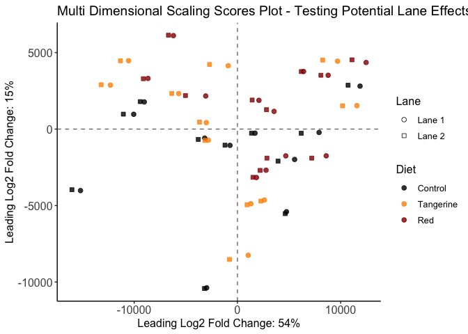
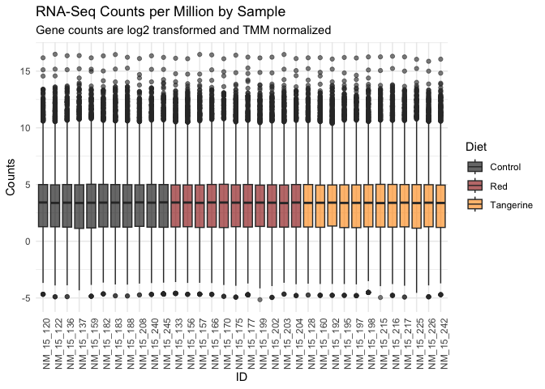
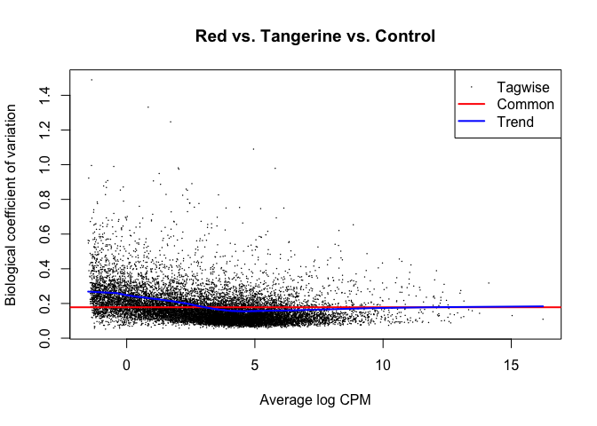
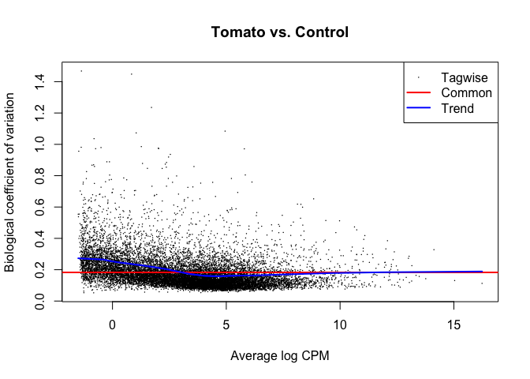
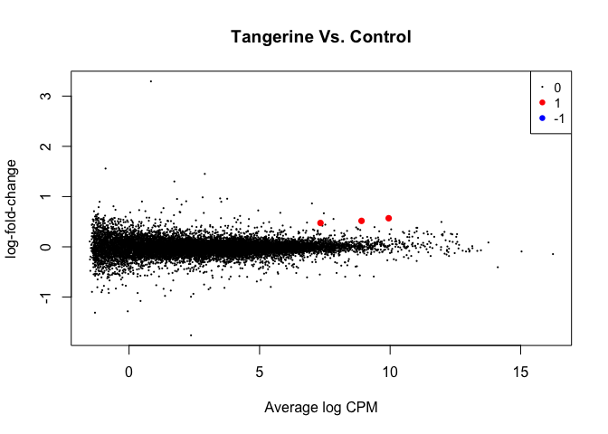
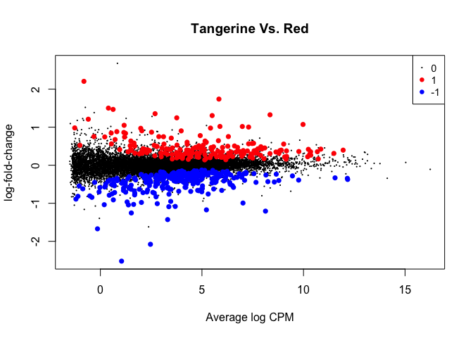
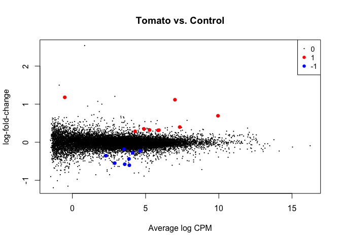

Tomato-fed Mouse Liver RNAseq Data Analysis
================
Michael Dzakovich and Jessica Cooperstone
11/16/2018 and also after

- <a href="#introduction" id="toc-introduction">Introduction</a>
  - <a href="#load-libraries" id="toc-load-libraries">Load libraries</a>
  - <a href="#lets-build-an-index-of-the-mouse-genome"
    id="toc-lets-build-an-index-of-the-mouse-genome">Let’s build an index of
    the mouse genome</a>
  - <a href="#lets-align-the-reads-lane-1"
    id="toc-lets-align-the-reads-lane-1">Let’s align the reads (lane 1)</a>
  - <a href="#lets-align-the-reads-lane-2"
    id="toc-lets-align-the-reads-lane-2">Let’s align the reads (lane 2)</a>
    - <a href="#get-bam-files-from-lane-1"
      id="toc-get-bam-files-from-lane-1">Get BAM files from lane 1</a>
    - <a href="#get-bam-files-from-lane-2"
      id="toc-get-bam-files-from-lane-2">Get BAM files from lane 2</a>
  - <a href="#testing-for-potential-lane-effects-by-mds"
    id="toc-testing-for-potential-lane-effects-by-mds">Testing for potential
    lane effects by MDS</a>
    - <a href="#mds-scores-plot-to-check-for-potential-lane-effects"
      id="toc-mds-scores-plot-to-check-for-potential-lane-effects">MDS scores
      plot to check for potential lane effects</a>
  - <a href="#lets-get-our-combined-feature-counts"
    id="toc-lets-get-our-combined-feature-counts">Let’s get our combined
    feature counts</a>
  - <a href="#visualizing-our-raw-count-data"
    id="toc-visualizing-our-raw-count-data">Visualizing our raw count
    data</a>
    - <a href="#mds-scores-plot-to-check-data-after-merging-lanes"
      id="toc-mds-scores-plot-to-check-data-after-merging-lanes">MDS scores
      plot to check data after merging lanes</a>
  - <a href="#preprocessing-our-data"
    id="toc-preprocessing-our-data">Preprocessing our data</a>
    - <a href="#cpm-normalization" id="toc-cpm-normalization">CPM
      normalization</a>
    - <a href="#tmm-normalization" id="toc-tmm-normalization">TMM
      normalization</a>
    - <a href="#box-and-whisker-plot-of-tmm-normalized-log2-data"
      id="toc-box-and-whisker-plot-of-tmm-normalized-log2-data">Box and
      whisker plot of TMM normalized log2 data</a>
  - <a href="#differential-expression"
    id="toc-differential-expression">Differential expression</a>
    - <a href="#creating-model-matrices-and-estimating-dispersion"
      id="toc-creating-model-matrices-and-estimating-dispersion">Creating
      model matrices and estimating dispersion</a>
  - <a href="#fitting-genewise-negative-binomial-generalized-linear-models"
    id="toc-fitting-genewise-negative-binomial-generalized-linear-models">Fitting
    genewise negative binomial generalized linear models</a>
  - <a href="#contrasts-between-treatments"
    id="toc-contrasts-between-treatments">Contrasts between treatments</a>
    - <a href="#tomato-vs-control" id="toc-tomato-vs-control">Tomato vs
      Control</a>
  - <a href="#summarizing-de-expression-analyses"
    id="toc-summarizing-de-expression-analyses">Summarizing DE expression
    analyses</a>
  - <a href="#writing-results-to-csv-files"
    id="toc-writing-results-to-csv-files">Writing results to CSV files</a>

# Introduction

## Load libraries

``` r
library(limma)
library(Glimma)
library(edgeR)
library(Rsubread)
library(RColorBrewer)
library(reshape2)
library(gplots)
library(tidyverse)
```

## Let’s build an index of the mouse genome

``` r
buildindex(basename="MouseRsubread_index",reference="GRCm38.p6.genome.fa")
#Indexing allows for more efficient read alignment

#Load our FASTQ files: 

fastq.files.L1R1<-list.files(path = "/fs/project/PAS0471/osu10028/DzakovichRNASeq/TrimmedFASTQFiles/Lane1/", pattern = "NM.*_R1_001.paired.fastq.gz$", full.names = TRUE)

fastq.files.L1R2<-list.files(path = "/fs/project/PAS0471/osu10028/DzakovichRNASeq/TrimmedFASTQFiles/Lane1/", pattern = "NM.*_R2_001.paired.fastq.gz$", full.names = TRUE)

fastq.files.L2R1<-list.files(path = "/fs/project/PAS0471/osu10028/DzakovichRNASeq/TrimmedFASTQFiles/Lane2/", pattern = "NM.*_R1_001.paired.fastq.gz$", full.names = TRUE)

fastq.files.L2R2<-list.files(path = "/fs/project/PAS0471/osu10028/DzakovichRNASeq/TrimmedFASTQFiles/Lane2/", pattern = "NM.*_R2_001.paired.fastq.gz$", full.names = TRUE)
```

## Let’s align the reads (lane 1)

``` r
#Map paired-end reads:
align(index="MouseRsubread_index",readfile1 = fastq.files.L1R1 ,readfile2 = fastq.files.L1R2 ,type = "rna", nthreads = 28)

#Check parameters used in alignment: 
args(align)

##Summary of proportion of read alignment: 
Lane1bam.files <- list.files(path = "/fs/project/PAS0471/osu10028/DzakovichRNASeq/TrimmedFASTQFiles/Lane1/", pattern = ".BAM$", full.names = TRUE)
propsLane1<-propmapped(Lane1bam.files, properlyPaired=TRUE)
write.table(propsLane1,"MousealignmentProportionsLane1Rsubread.txt", sep = "\t")
```

## Let’s align the reads (lane 2)

``` r
#Change working directory
setwd("/fs/project/PAS0471/osu10028/DzakovichRNASeq/TrimmedFASTQFiles/Lane2/")
#Make sure you copy the index you made to the Lane2 folder as well

#Map paired-end reads:
align(index="MouseRsubread_index",readfile1 = fastq.files.L2R1 ,readfile2 = fastq.files.L2R2 ,type = "rna", nthreads = 28)

#Check parameters used in alignment: 
args(align)

##Summary of proportion of read alignment: 
Lane2bam.files <- list.files(path = "/fs/project/PAS0471/osu10028/DzakovichRNASeq/TrimmedFASTQFiles/Lane2/", pattern = ".BAM$", full.names = TRUE)
propsLane2<-propmapped(Lane2bam.files, properlyPaired=TRUE)
write.table(propsLane2,"MousealignmentProportionsLane2Rsubread.txt", sep = "\t")
```

### Get BAM files from lane 1

``` r
#Get bam files:
#Lane 1
bam.filesLane1 <- list.files(path = "/fs/project/PAS0471/osu10028/DzakovichRNASeq/TrimmedFASTQFiles/Lane1/", pattern = "NM.*.BAM$", full.names = TRUE) 


#Get feature counts 
fcLane1 <- featureCounts(bam.filesLane1, annot.ext = "gencode.vM17.annotation.gff3.gz", 
                    isGTFAnnotationFile = TRUE, nthreads=28, isPairedEnd=TRUE, 
                    GTF.featureType = "gene")

annotationLane1<-(fcLane1$annotation)
write.csv(annotationLane1, file="100918_Lane1Annotation.csv")

propsLane1<-propmapped(bam.filesLane1, properlyPaired=TRUE)
write.table(propsLane1,"Lane1MousealignmentProportionsRsubread.txt", sep = "\t")

# See what slots are stored in fc
names(fcLane1)

## Take a look at the featurecounts stats
fcLane1$stat
annotationLane1<-(fcLane1$annotation)

##Counts 
head(fcLane1$counts)
```

### Get BAM files from lane 2

``` r
#Lane 2 

bam.filesLane2 <- list.files(path = "/fs/project/PAS0471/osu10028/DzakovichRNASeq/TrimmedFASTQFiles/Lane2/", pattern = "NM.*.BAM$", full.names = TRUE)

fcLane2 <- featureCounts(bam.filesLane2, annot.ext = "gencode.vM17.annotation.gff3.gz", 
                         isGTFAnnotationFile = TRUE, nthreads=28, isPairedEnd=TRUE, 
                         GTF.featureType = "gene")

annotationLane2<-(fcLane2$annotation)
write.csv(annotationLane2, file="100918_Lane2Annotation.csv")

propsLane2<-propmapped(bam.filesLane2, properlyPaired=TRUE)
write.table(propsLane2,"Lane2MousealignmentProportionsRsubread.txt", sep = "\t")

## Take a look at the featurecounts stats
fcLane2$stat
annotationLane2<-(fcLane2$annotation)

##Counts 
head(fcLane2$counts)
```

> For the convenience of the user, a text file (MergedCountData2.txt) is
> available to directly import to save time needed for calculating
> feature counts. Samples NM_15_186 and NM_15_189 (determined to be
> outliers) are already removed in MergedCountData2.txt. Should the user
> want to generate counts from scratch, the code above will accomplish
> these steps and then the Lane 1 and Lane 2 counts will need to be
> combined into a singular dataframe. The path specified in the “Get BAM
> Files from Lane 1/2” chunks will need to be changed to the user’s
> desired location where BAM files are being stored.

## Testing for potential lane effects by MDS

``` r
#knitr::opts_chunk$set(echo = TRUE)
 
#knitr::opts_knit$set(root.dir = "/fs/project/PAS0471/osu10028/DzakovichRNASeq/TrimmedFASTQFiles/Lane1/")

#setwd("/fs/project/PAS0471/osu10028/DzakovichRNASeq/TrimmedFASTQFiles/Lane1/")


BothLanesCount <- read.table("BothLanesCount2.txt", header=T)


#Make MDS Plot

MDSplot<-plotMDS(BothLanesCount[,-1])
```

``` r
Diet = c("Control","Control","Tangerine","Red","Control","Control","Red",
              "Red","Control","Tangerine","Red","Red","Red","Red","Control",
              "Control","Control","Tangerine","Tangerine",
              "Tangerine","Tangerine","Red","Red","Red","Red","Control",
              "Tangerine","Tangerine","Tangerine","Tangerine","Tangerine",
              "Control","Tangerine","Control","Control","Control","Tangerine",
              "Red","Control","Control","Red",    
              "Red","Control","Tangerine","Red","Red","Red","Red","Control",
              "Control","Control","Tangerine","Tangerine",
              "Tangerine","Tangerine","Red","Red","Red","Red","Control",
              "Tangerine","Tangerine","Tangerine","Tangerine","Tangerine",
              "Control","Tangerine","Control")

Lane = c("Lane 1","Lane 1","Lane 1","Lane 1","Lane 1",
         "Lane 1","Lane 1","Lane 1","Lane 1","Lane 1","Lane 1","Lane 1",
         "Lane 1","Lane 1","Lane 1","Lane 1","Lane 1","Lane 1","Lane 1",
         "Lane 1","Lane 1","Lane 1","Lane 1","Lane 1","Lane 1","Lane 1",
         "Lane 1","Lane 1","Lane 1","Lane 1","Lane 1","Lane 1","Lane 1",
         "Lane 1","Lane 2","Lane 2","Lane 2","Lane 2","Lane 2","Lane 2",
         "Lane 2","Lane 2","Lane 2","Lane 2","Lane 2","Lane 2","Lane 2",
         "Lane 2","Lane 2","Lane 2","Lane 2","Lane 2","Lane 2","Lane 2",
         "Lane 2","Lane 2","Lane 2","Lane 2","Lane 2","Lane 2","Lane 2",
         "Lane 2","Lane 2","Lane 2","Lane 2","Lane 2","Lane 2","Lane 2")


Diet<-as.factor(Diet)
Lane<-as.factor(Lane)

MDSLane_X<-MDSplot$x
MDSLane_X<-as.numeric(MDSLane_X)
MDSLane_Y<-MDSplot$y
MDSLane_Y<-as.numeric(MDSLane_Y)

MDSLaneCheck<-data.frame(Diet, Lane, MDSLane_X, MDSLane_Y)
```

### MDS scores plot to check for potential lane effects

``` r
LaneEffectsCheck<-
  MDSLaneCheck%>%
  ggplot(aes(x = MDSLane_X, y = MDSLane_Y, color = Diet, fill=Diet, shape = Lane)) +
  geom_point(size = 2, alpha = 0.8) +
  geom_hline(yintercept = 0, linetype = "dashed", color = "black", alpha = 0.6) +
  geom_vline(xintercept = 0, linetype = "dashed", color = "black", alpha = 0.6) +
  scale_color_manual(values = c("black", "#FF9300", "#941100"),
                    labels = expression("Control", 
                                        "Tangerine", 
                                        "Red")) +
  scale_fill_manual(values = c("black", "#FF9300", "#941100"),
                    labels = expression("Control", 
                                        "Tangerine", 
                                        "Red")) + 
  scale_shape_manual(values=c(21,22),
                    labels = expression("Lane 1", 
                                        "Lane 2")) +
  theme_classic() + 
  theme(text = element_text(size = 12),
        axis.title = element_text(size = 12),
        axis.text = element_text(size = 12),
        legend.text.align = 0) +
  labs(title = "Multi Dimensional Scaling Scores Plot - Testing Potential Lane Effects",
       x = "Leading Log2 Fold Change: 54%",
       y = "Leading Log2 Fold Change: 15%") 

LaneEffectsCheck
```

<!-- -->

``` r
#ggsave("MDS_LaneEffectCheck.png", plot=LaneEffectsCheck, dpi=800, width = 9, height = 6, units ="in", device="png")
```

> In our case, we do not have an appreciable lane effects. Therefore, we
> merged the count data from Lane 1 and Lane 2 together using BAMTools.
> This is a Linux based software and a batch file to run this code is
> available (BAMFilesMerge.pbs). This code allows the user to automate
> the process of merging BAM files from different lanes. Output was
> checked to ensure merging was successful and accurate.

## Let’s get our combined feature counts

``` r
setwd("/fs/project/PAS0471/osu10028/DzakovichRNASeq/TrimmedFASTQFiles/MergedBAMFiles/")

bam.filesTotal <- list.files(path = "/fs/project/PAS0471/osu10028/DzakovichRNASeq/TrimmedFASTQFiles/MergedBAMFiles/", pattern = "NM.*.BAM$", full.names = TRUE)


fc <- featureCounts(bam.filesTotal, annot.ext = "gencode.vM17.annotation.gff3.gz", 
                         isGTFAnnotationFile = TRUE, nthreads=28, isPairedEnd=TRUE, 
                         GTF.featureType = "gene", countMultiMappingReads=FALSE)

TotalCounts<-(fc$counts)
```

> For the convenience of the user, a text file
> (TotalCounts_OutliersRemoved.txt) is available to directly import to
> save time needed for calculating feature counts.

## Visualizing our raw count data

``` r
#06/07/2022: Trying to remove the two samples (186 and 189) deemed outliers 
Diet = c("Control","Control","Tangerine","Red","Control","Control","Red",
              "Red","Control","Tangerine","Red","Red","Red","Red","Control",
              "Control","Control","Tangerine","Tangerine",
              "Tangerine","Tangerine","Red","Red","Red","Red","Control",
              "Tangerine","Tangerine","Tangerine","Tangerine","Tangerine",
              "Control","Tangerine","Control")


TotalFC <- read.table("TotalCounts_OutliersRemoved.txt", header=T)
#I'm exporting our count data as a text file so that it can be reimported as a less complicated object in the future. 

###Make an MDS plot labeling "treatment"

MergedLanesMDS<-plotMDS(TotalFC)
```

### MDS scores plot to check data after merging lanes

``` r
Diet<-as.factor(Diet)


MDSLane_X<-MergedLanesMDS$x
MDSLane_X<-as.numeric(MDSLane_X)
MDSLane_Y<-MergedLanesMDS$y
MDSLane_Y<-as.numeric(MDSLane_Y)

MergedLanesMDS<-data.frame(Diet, MDSLane_X, MDSLane_Y)


LanesCombined<-
  MergedLanesMDS%>%
  ggplot(aes(x = MDSLane_X, y = MDSLane_Y, color = Diet, fill=Diet)) +
  geom_point(size = 2, alpha = 0.8) +
  geom_hline(yintercept = 0, linetype = "dashed", color = "black", alpha = 0.6) +
  geom_vline(xintercept = 0, linetype = "dashed", color = "black", alpha = 0.6) +
  scale_color_manual(values = c("black", "#FF9300", "#941100"),
                    labels = expression("Control", 
                                        "Tangerine", 
                                        "Red")) +
  scale_fill_manual(values = c("black", "#FF9300", "#941100"),
                    labels = expression("Control", 
                                        "Tangerine", 
                                        "Red")) + 
  theme_classic() + 
  theme(text = element_text(size = 12),
        axis.title = element_text(size = 12),
        axis.text = element_text(size = 12),
        legend.text.align = 0) +
  labs(title = "Multi Dimensional Scaling Scores Plot After Merging Lanes",
       x = "Leading Log2 Fold Change: 54%",
       y = "Leading Log2 Fold Change: 15%") 

LanesCombined
```

<!-- -->

``` r
#ggsave("MDS_3DietPlot.png", plot=LanesCombined, dpi=800, width = 9, height = 6, units ="in", device="png")
```

> Compared to the untargeted metabolomics data, separation by diet is
> not apparent. Expression may only be marginally affected by tomato
> consumption which makes sense from a biological standpoint, as we
> would not expect thousands of genes to be differentially expressed.
> Differential expression analysis will allow us to see any subtle
> differences among treatment groups.

## Preprocessing our data

``` r
#setwd("/fs/project/PAS0471/osu10028/DzakovichRNASeq/TrimmedFASTQFiles/MergedBAMFiles/")
#TotalFC <- read.table("TotalCounts_OutliersRemoved.txt")
Class <- read.csv("MouseClassifications_OutliersRemoved.csv", stringsAsFactors = FALSE)
#The file "MouseClassification.csv" contains treatment information for all mice analyzed in this study


group<-paste(Class$Diet)
samplenames<-paste(Class$Animal_ID)
group<-factor(group)
samplenames<-factor(samplenames)
table(group)
```

    ## group
    ##   Control       Red Tangerine 
    ##        11        11        12

``` r
table(samplenames)
```

    ## samplenames
    ## NM-15-120 NM-15-122 NM-15-128 NM-15-133 NM-15-136 NM-15-137 NM-15-156 NM-15-157 
    ##         1         1         1         1         1         1         1         1 
    ## NM-15-159 NM-15-160 NM-15-166 NM-15-170 NM-15-175 NM-15-177 NM-15-182 NM-15-183 
    ##         1         1         1         1         1         1         1         1 
    ## NM-15-188 NM-15-192 NM-15-195 NM-15-197 NM-15-198 NM-15-199 NM-15-202 NM-15-203 
    ##         1         1         1         1         1         1         1         1 
    ## NM-15-204 NM-15-208 NM-15-215 NM-15-216 NM-15-217 NM-15-225 NM-15-226 NM-15-240 
    ##         1         1         1         1         1         1         1         1 
    ## NM-15-242 NM-15-245 
    ##         1         1

``` r
fc <- DGEList(TotalFC, group=group, samples=samplenames, genes=TotalFC[,1,drop=FALSE])
```

### CPM normalization

``` r
#Raw counts are converted to CPM and log-CPM values using the cpm function
cpm<-cpm(fc)
lcpm <- cpm(fc, log=TRUE)

#Removing genes that are lowly expressed
table(rowSums(fc$counts==0)) 
```

    ## 
    ##     0     1     2     3     4     5     6     7     8     9    10    11    12 
    ## 14968   540   372   242   195   233   170   172   148   139   165   162   147 
    ##    13    14    15    16    17    18    19    20    21    22    23    24    25 
    ##   154   189   178   157   178   164   195   196   197   217   242   242   257 
    ##    26    27    28    29    30    31    32    33    34 
    ##   304   339   385   482   606   831  1240  2420 26889

``` r
keep.exprs <- rowSums(cpm(fc)>0.37)>=11

#The first value used (0.37) is calculated based on a rule of thumb (10/Library size in millions) provided in the following guide: https://f1000research.com/articles/5-1438/v2

#Actual library size after alignment is on average 27.28 million reads. Therefore, 10/27.28 = 0.37

#The number 11 specifies number of libraries that a gene needs to be expressed in in order to be kept. I chose >=11 because that would account for situations where a gene is expressed only in one of our treatment groups and in all of the samples within that treatment group. This number could potentially be reduced to be a bit less stringent, but may make data noisier.

table(keep.exprs)
```

    ## keep.exprs
    ## FALSE  TRUE 
    ## 39640 14075

``` r
fc <- fc[keep.exprs, , keep.lib.sizes=FALSE]
dim(fc)
```

    ## [1] 14075    34

### TMM normalization

``` r
fc2 <- calcNormFactors(fc, method = "TMM")


#Boxplot test of TMM normalized counts
#Can also try pseudocounts by adding +1 to CountsCPM. Doing so will eliminate negative numbers
NormLibSize <- fc2$samples$lib.size*fc2$samples$norm.factors
CountsCPM <- cpm(fc2, normalized.lib.size=TRUE)
Log2CountsCPM <- log2(CountsCPM)
boxplot(Log2CountsCPM, col="gray", las=3)
```

### Box and whisker plot of TMM normalized log2 data

``` r
QCCounts<-as.data.frame(Log2CountsCPM)
QCCounts<-as.data.frame(t(QCCounts))
Class2<-as.data.frame(Diet)

SampleIDsNumeric<-c("NM_15_120","NM_15_122","NM_15_128","NM_15_133","NM_15_136",
                    "NM_15_137","NM_15_156","NM_15_157","NM_15_159","NM_15_160",
                    "NM_15_166","NM_15_170","NM_15_175","NM_15_177","NM_15_182",
                    "NM_15_183","NM_15_188","NM_15_192","NM_15_195","NM_15_197",
                    "NM_15_198","NM_15_199","NM_15_202","NM_15_203","NM_15_204",
                    "NM_15_208","NM_15_215","NM_15_216","NM_15_217","NM_15_225",
                    "NM_15_226","NM_15_240","NM_15_242","NM_15_245")

QCCountInput<-data.frame(SampleIDsNumeric, Class2, QCCounts)

names(QCCountInput)[names(QCCountInput) == 'SampleIDsNumeric'] <- 'ID'


RNAseqQualityData_long <- QCCountInput %>%
  pivot_longer(cols = ENSMUSG00000025902.13:ncol(.),
               names_to = "GeneID",
               values_to = "Counts")

RNAseqQualityData_long$Diet <- factor(RNAseqQualityData_long$Diet,
                                      levels = c("Control", "Red", "Tangerine"))

RNAseqQualityData_long <- RNAseqQualityData_long %>%
  arrange(Diet) %>%
  mutate(ID = fct_inorder(ID))

(RNASeq_quality_boxplot <- RNAseqQualityData_long %>%
  ggplot(aes(x = ID, y = Counts, fill = Diet)) +
  geom_boxplot(alpha = 0.6) +
  scale_fill_manual(values = c("black", "#941100", "#FF9300")) +
  theme_minimal() +
  #scale_y_continuous(limits = c(-1, 17)) +
  theme(axis.text.x = element_text(angle = 90)) +
  labs(title = "RNA-Seq Counts per Million by Sample",
       subtitle = "Gene counts are log2 transformed and TMM normalized"))
```

<!-- -->

``` r
#ggsave("RNASeqQCBW.png", plot=RNASeq_quality_boxplot, dpi=800, width = 9, height = 6, units ="in", device="png")
```

## Differential expression

``` r
TotalFC_b<-fc$counts

###

C<-TotalFC_b[,c(1:2,5:6,9,15:17,26,32,34)]
T<-TotalFC_b[,c(3,10,18:21,27:31,33)]
R<-TotalFC_b[,c(4,7:8,11:14,22:25)]

TotalFC_b<-data.frame(C,R,T)

#head(TotalFC_b)

#Since my samples aren't in order of treatment, the steps above assigned the correct treatment to each sample and essentially reorganized everything so that like treatments are near like. Doing this is important for contrasts that will be performed later. 

treatment <- c(rep("C", 11), rep("R", 11), rep("T", 12))
treatment2 <-c(rep("C", 11), rep("T", 23))

#The above two lines of code are again used to assign treatments. The second line (treatment2) groups both types of tomato together to compare to control. All objects created with the number "2" appended to it are henceforth referring to analyses comparing control to tomato. 

counts<-TotalFC_b
cds<-DGEList(counts,group=treatment)
cds2<-DGEList(counts,group=treatment2)

#Doing TMM normalization here since RNAseq data was switched to dataframe to assign treatments and order samples for future contrasts

cds <- calcNormFactors(cds, method = "TMM")
cds2 <- calcNormFactors(cds2, method = "TMM")

#cds2 is for control vs tomato contrast 
```

### Creating model matrices and estimating dispersion

``` r
mod <- model.matrix(~0+cds$samples$group)
mod2<- model.matrix(~0+cds2$samples$group)


cds <- estimateDisp(cds, design = mod )
plotBCV(cds, xlab="Average log CPM", ylab="Biological coefficient of variation", main="Red vs. Tangerine vs. Control")
```

<!-- -->

``` r
cds2 <- estimateDisp(cds2, design = mod2 )
plotBCV(cds2, xlab="Average log CPM", ylab="Biological coefficient of variation", main="Tomato vs. Control")
```

<!-- -->

> Looks good: no apparent trend in disperson (relationship between
> counts and variance remaining relatively similar across our data).

## Fitting genewise negative binomial generalized linear models

``` r
#Fit GLM QL:
fit <- glmQLFit(cds, mod)

#Fit GLM QL for Control vs Tomato
fit2 <-glmQLFit(cds2, mod2)

head(fit$coefficients)
```

    ##                       cds$samples$groupC cds$samples$groupR cds$samples$groupT
    ## ENSMUSG00000025902.13         -13.810138         -13.758499         -13.807487
    ## ENSMUSG00000102269.1          -15.009314         -14.853126         -14.944657
    ## ENSMUSG00000098104.1          -13.117286         -13.134502         -13.163512
    ## ENSMUSG00000103922.1          -10.392438         -10.515042         -10.328601
    ## ENSMUSG00000033845.13          -9.931383          -9.964661          -9.949491
    ## ENSMUSG00000104217.1          -14.501628         -14.671007         -14.654730

## Contrasts between treatments

``` r
design<-model.matrix(~treatment)
fit<-glmQLFit(cds,design)

qlfRedVsControl.2vs1<- glmQLFTest(fit, coef = 2)
topTags(qlfRedVsControl.2vs1)
```

    ## Coefficient:  treatmentR 
    ##                            logFC     logCPM        F       PValue          FDR
    ## ENSMUSG00000003053.17  0.8195311  9.9449025 68.95220 7.588949e-10 1.068145e-05
    ## ENSMUSG00000093610.7   1.5428921 -0.5195167 41.60281 1.838126e-07 1.293581e-03
    ## ENSMUSG00000025504.13  0.6754605  4.7882679 38.13150 4.247134e-07 1.992614e-03
    ## ENSMUSG00000055254.15 -1.1402045  5.4222471 32.87018 1.640422e-06 4.538076e-03
    ## ENSMUSG00000074063.10  1.3487993  7.0059277 32.54614 1.789098e-06 4.538076e-03
    ## ENSMUSG00000021252.11 -0.3274462  6.3929881 31.75177 2.217211e-06 4.538076e-03
    ## ENSMUSG00000044768.16 -0.6013554  3.8678902 31.68644 2.256947e-06 4.538076e-03
    ## ENSMUSG00000026107.11 -0.7235089  3.5755130 28.48308 5.518656e-06 9.709385e-03
    ## ENSMUSG00000031217.8   0.3687535  3.8202477 27.18700 8.032434e-06 1.086991e-02
    ## ENSMUSG00000091586.1   0.5436014  3.0455364 27.06780 8.318011e-06 1.086991e-02

``` r
DERedControl<-decideTestsDGE(qlfRedVsControl.2vs1, adjust.method = "BH", p.value = 0.1)
plotMD(qlfRedVsControl.2vs1, status=DERedControl, values=c(1,-1), col=c("red","blue"), legend="topright", main="Red Vs. Control")
```

<!-- -->

``` r
qlfTangerineVsControl.3vs1<- glmQLFTest(fit, coef = 3)
topTags(qlfTangerineVsControl.3vs1)
```

    ## Coefficient:  treatmentT 
    ##                            logFC   logCPM        F       PValue        FDR
    ## ENSMUSG00000003053.17  0.5689394 9.944902 34.71264 1.009768e-06 0.01344180
    ## ENSMUSG00000032310.4   0.5164533 8.904642 32.30293 1.910024e-06 0.01344180
    ## ENSMUSG00000018166.8   0.4747648 7.332935 28.41163 5.632837e-06 0.02642739
    ## ENSMUSG00000013833.15  0.2091084 4.328938 21.69581 4.346430e-05 0.13430118
    ## ENSMUSG00000022704.15 -0.4222691 2.280841 21.40836 4.770912e-05 0.13430118
    ## ENSMUSG00000049985.15  0.9638391 3.489464 20.08676 7.372214e-05 0.17293986
    ## ENSMUSG00000044763.8  -0.3085513 4.118999 18.54800 1.241712e-04 0.19366930
    ## ENSMUSG00000029389.17 -0.3415388 2.347388 18.25058 1.375990e-04 0.19366930
    ## ENSMUSG00000028292.14 -0.2018836 3.526429 18.02688 1.487098e-04 0.19366930
    ## ENSMUSG00000045374.18  0.2973657 5.275080 17.98330 1.509829e-04 0.19366930

``` r
DETangerineControl<-decideTestsDGE(qlfTangerineVsControl.3vs1, adjust.method = "BH", p.value = 0.1)
plotMD(qlfTangerineVsControl.3vs1, status=DETangerineControl, values=c(1,-1), col=c("red","blue"), legend="topright", main="Tangerine Vs. Control")
```

<!-- -->

``` r
qlfTangerineVsRed.3vs2<- glmQLFTest(fit, contrast=c(0,-1,1))
topTags(qlfTangerineVsRed.3vs2)
```

    ## Coefficient:  -1*treatmentR 1*treatmentT 
    ##                            logFC   logCPM        F       PValue         FDR
    ## ENSMUSG00000025504.13 -0.6600175 4.788268 38.29514 4.078989e-07 0.002788883
    ## ENSMUSG00000022615.7  -0.6613990 5.974764 37.80999 4.599193e-07 0.002788883
    ## ENSMUSG00000000876.11 -0.5016179 6.391861 34.60175 1.039299e-06 0.002788883
    ## ENSMUSG00000063870.12 -0.3353141 6.573632 34.40134 1.095008e-06 0.002788883
    ## ENSMUSG00000013150.15 -0.4758683 2.729312 34.18164 1.159724e-06 0.002788883
    ## ENSMUSG00000028976.10  0.7493720 3.108075 33.76986 1.292166e-06 0.002788883
    ## ENSMUSG00000022246.14 -0.3445803 4.653452 33.50153 1.387011e-06 0.002788883
    ## ENSMUSG00000046562.5  -0.2712861 5.070145 30.75049 2.916860e-06 0.004962278
    ## ENSMUSG00000091586.1  -0.5626060 3.045536 30.44633 3.173038e-06 0.004962278
    ## ENSMUSG00000021252.11  0.3055187 6.392988 28.76592 5.090097e-06 0.007164312

``` r
DETangerineRed<-decideTestsDGE(qlfTangerineVsRed.3vs2, adjust.method = "BH", p.value = 0.1)
plotMD(qlfTangerineVsRed.3vs2, status=DETangerineRed, values=c(1,-1), col=c("red","blue"), legend="topright", main="Tangerine Vs. Red")
```

<!-- -->

### Tomato vs Control

``` r
design2<-model.matrix(~treatment2)
fit2<-glmQLFit(cds2,design2)
qlfTomatoVsControl.2vs1<- glmQLFTest(fit2, coef = 2)
topTags(qlfTomatoVsControl.2vs1, 10)
```

    ## Coefficient:  treatment2T 
    ##                            logFC     logCPM        F       PValue          FDR
    ## ENSMUSG00000003053.17  0.6942262  9.9449024 54.67235 9.205636e-09 0.0001295693
    ## ENSMUSG00000045374.18  0.3211542  5.2750791 26.85442 8.290727e-06 0.0575677696
    ## ENSMUSG00000074063.10  1.1158926  7.0059271 25.46315 1.260811e-05 0.0575677696
    ## ENSMUSG00000026107.11 -0.5780335  3.5754891 23.92295 2.029575e-05 0.0575677696
    ## ENSMUSG00000018166.8   0.3985563  7.3329355 23.63208 2.223773e-05 0.0575677696
    ## ENSMUSG00000032702.16  0.3179015  5.9114975 22.53950 3.148120e-05 0.0575677696
    ## ENSMUSG00000026333.14 -0.5489948  2.8957276 22.40123 3.291330e-05 0.0575677696
    ## ENSMUSG00000027787.14 -0.2296984  4.6289735 22.21685 3.493130e-05 0.0575677696
    ## ENSMUSG00000022797.15 -0.6041807  3.8898578 21.87470 3.903062e-05 0.0575677696
    ## ENSMUSG00000093610.7   1.1796475 -0.5196532 21.73104 4.090072e-05 0.0575677696

``` r
DEControlTomato<-decideTestsDGE(qlfTomatoVsControl.2vs1, adjust.method = "BH", p.value = 0.1)
plotMD(qlfTomatoVsControl.2vs1, status=DEControlTomato, values=c(1,-1), col=c("red","blue"), legend="topright", main="Tomato vs. Control")
```

<!-- -->

## Summarizing DE expression analyses

``` r
DEgenesTomatoControl<-topTags(qlfTomatoVsControl.2vs1, n = Inf, adjust.method = "BH", sort.by = "PValue", p.value = 0.1)
summary(decideTestsDGE(qlfTomatoVsControl.2vs1, adjust.method = "BH", p.value = 0.1, lfc = 0))
```

    ##        treatment2T
    ## Down             8
    ## NotSig       14058
    ## Up               9

``` r
DEgenesTangerineRed<-topTags(qlfTangerineVsRed.3vs2, n = Inf, adjust.method = "BH", sort.by = "PValue", p.value = 0.1)
summary(decideTestsDGE(qlfTangerineVsRed.3vs2, adjust.method = "BH", p.value = 0.1, lfc = 0))
```

    ##        -1*treatmentR 1*treatmentT
    ## Down                          283
    ## NotSig                      13608
    ## Up                            184

``` r
DEgenesTangerineControl<-topTags(qlfTangerineVsControl.3vs1, n = Inf, adjust.method = "BH", sort.by = "PValue", p.value = 0.1)
summary(decideTestsDGE(qlfTangerineVsControl.3vs1, adjust.method = "BH", p.value = 0.1, lfc = 0))
```

    ##        treatmentT
    ## Down            0
    ## NotSig      14072
    ## Up              3

``` r
DEgenesRedControl<-topTags(qlfRedVsControl.2vs1, n = Inf, adjust.method = "BH", sort.by = "PValue", p.value = 0.1)
summary(decideTestsDGE(qlfRedVsControl.2vs1, adjust.method = "BH", p.value = 0.1, lfc = 0))
```

    ##        treatmentR
    ## Down          159
    ## NotSig      13757
    ## Up            159

## Writing results to CSV files

``` r
DEgenesTomatoControl<-topTags(qlfTomatoVsControl.2vs1, n = Inf, adjust.method = "BH", sort.by = "PValue", p.value = 0.1)
summary(decideTestsDGE(qlfTomatoVsControl.2vs1, adjust.method = "BH", p.value = 0.1, lfc = 0))
write.csv(DEgenesTomatoControl$table[abs(DEgenesTomatoControl$table$logFC)>=0,], "DEgenesTomatoControl_0pt1FDR_OutliersRemoved_12122022.csv", sep = "\t", quote = FALSE)

DEgenesTangerineRed<-topTags(qlfTangerineVsRed.3vs2, n = Inf, adjust.method = "BH", sort.by = "PValue", p.value = 0.1)
summary(decideTestsDGE(qlfTangerineVsRed.3vs2, adjust.method = "BH", p.value = 0.1, lfc = 0))
write.csv(DEgenesTangerineRed$table[abs(DEgenesTangerineRed$table$logFC)>=0,], "DEgenesTangerineRed_0pt1FDR_OutliersRemoved_12122022.csv", sep = "\t", quote = FALSE)

DEgenesTangerineControl<-topTags(qlfTangerineVsControl.3vs1, n = Inf, adjust.method = "BH", sort.by = "PValue", p.value = 0.1)
summary(decideTestsDGE(qlfTangerineVsControl.3vs1, adjust.method = "BH", p.value = 0.1, lfc = 0))
write.csv(DEgenesTangerineControl$table[abs(DEgenesTangerineControl$table$logFC)>=0,], "DEgenesTangerineControl_0pt1FDR_OutliersRemoved_12122022.csv", sep = "\t", quote = FALSE)

DEgenesRedControl<-topTags(qlfRedVsControl.2vs1, n = Inf, adjust.method = "BH", sort.by = "PValue", p.value = 0.1)
summary(decideTestsDGE(qlfRedVsControl.2vs1, adjust.method = "BH", p.value = 0.1, lfc = 0))
write.csv(DEgenesRedControl$table[abs(DEgenesRedControl$table$logFC)>=0,], "DEgenesRedControl_0pt1FDR_OutliersRemoved_12122022.csv", sep = "\t", quote = FALSE)
```
