Tomato-fed mouse liver metabolomics data analysis
================
Michael Dzakovich, Jessica Cooperstone
So many times, published in 2023

- <a href="#introduction" id="toc-introduction">Introduction</a>
  - <a href="#load-libraries" id="toc-load-libraries">Load libraries</a>
  - <a href="#read-in-data" id="toc-read-in-data">Read in data</a>
  - <a href="#data-summaries" id="toc-data-summaries">Data summaries</a>
  - <a href="#missing-values-and-imputing"
    id="toc-missing-values-and-imputing">Missing values and imputing</a>
    - <a href="#missing-values" id="toc-missing-values">Missing values</a>
    - <a href="#removing-samples-with-lots-of-missingness"
      id="toc-removing-samples-with-lots-of-missingness">Removing samples with
      lots of missingness</a>
    - <a href="#untransformed-data" id="toc-untransformed-data">Untransformed
      data</a>
      - <a href="#data-quality-boxplot" id="toc-data-quality-boxplot">Data
        quality boxplot</a>
    - <a href="#log2-transform" id="toc-log2-transform">Log2 transform</a>
      - <a href="#data-quality-boxplot-1" id="toc-data-quality-boxplot-1">Data
        quality boxplot</a>
  - <a href="#pca-control-red-tangerine"
    id="toc-pca-control-red-tangerine">PCA: Control, Red, Tangerine</a>
    - <a href="#with-qcs" id="toc-with-qcs">With QCs</a>
    - <a href="#without-qcs" id="toc-without-qcs">Without QCs</a>
  - <a href="#pca-control-vs-tomato" id="toc-pca-control-vs-tomato">PCA:
    Control vs Tomato</a>
  - <a href="#kmeans-clustering" id="toc-kmeans-clustering">Kmeans
    clustering</a>
    - <a href="#control-vs-red-vs-tangerine-for-k--3-clusters"
      id="toc-control-vs-red-vs-tangerine-for-k--3-clusters">Control vs red vs
      tangerine, for k = 3 clusters</a>
    - <a href="#control-vs-tomato-for-k--2-clusters"
      id="toc-control-vs-tomato-for-k--2-clusters">Control vs tomato, for k =
      2 clusters</a>
    - <a href="#superimpose-on-pcas" id="toc-superimpose-on-pcas">Superimpose
      on PCAs</a>
      - <a href="#3-clusters" id="toc-3-clusters">3 clusters</a>
      - <a href="#2-clusters" id="toc-2-clusters">2 clusters</a>
  - <a href="#univariate-analysis" id="toc-univariate-analysis">Univariate
    analysis</a>
    - <a href="#anova-across-diets" id="toc-anova-across-diets">ANOVA across
      diets</a>
      - <a href="#heatmap-of-features-significant-by-anova"
        id="toc-heatmap-of-features-significant-by-anova">Heatmap of features
        significant by ANOVA</a>
    - <a href="#red-vs-tangerine" id="toc-red-vs-tangerine">Red
      vs. tangerine</a>
    - <a href="#red-vs-control" id="toc-red-vs-control">Red vs. control</a>
    - <a href="#tangerine-vs-control" id="toc-tangerine-vs-control">Tangerine
      vs. control</a>
    - <a href="#control-vs-tomato" id="toc-control-vs-tomato">Control
      vs. tomato</a>
      - <a href="#volcano-plot" id="toc-volcano-plot">Volcano plot</a>
        - <a href="#interactve-volcano-plot"
          id="toc-interactve-volcano-plot">Interactve volcano plot</a>

# Introduction

Title: Transcriptomics and Metabolomics Reveal Tomato Consumption Alters
Hepatic Xenobiotic Metabolism and Induces Steroidal Alkaloid Metabolite
Accumulation in Mice

Authors: Michael P. Dzakovich1,2, Mallory L. Goggans1, Jennifer M.
Thomas-Ahner3, Nancy Engelmann Moran2, Steven K. Clinton3, David M.
Francis4, Jessica L. Cooperstone1,5

Affiliations:  
1 The Ohio State University, Department of Horticulture and Crop
Science, 2001 Fyffe Court, Columbus, OH 43210.

2 USDA-ARS Children’s Nutrition Research Center, Department of
Pediatrics, Baylor College of Medicine, 1100 Bates Ave., Houston, TX
77030

3 The Ohio State University, Division of Medical Oncology, Department of
Internal Medicine

4 The Ohio State University, Ohio Agricultural Research and Development
Center, Department of Horticulture and Crop Science, 1680 Madison Ave,
Wooster, OH 44691.

5 The Ohio State University, Department of Food Science and Technology,
2015 Fyffe Court, Columbus, OH 43210.

Corresponding author: Jessica Cooperstone, PhD

2001 Fyffe Court

Columbus, OH 43210

<Cooperstone.1@osu.edu>

Keywords: liver, steroidal alkaloids, tomato, xenobiotic metabolism,
multi-omic integration

DOI: <https://doi.org/10.1101/2023.04.18.536606>

Abstract

**Scope:** Tomato consumption is associated with many health benefits
including lowered risk for developing certain cancers. It is
hypothesized that tomato phytochemicals are transported to the liver and
other tissues where they alter gene expression in ways that lead to
favorable health outcomes. However, the effects of tomato consumption on
mammalian liver gene expression and chemical profile are not well
defined.

**Methods and results:** We hypothesized that tomato consumption would
alter mouse liver transcriptomes and metabolomes compared to a control
diet. C57BL/6 mice (n=11-12/group) were fed a macronutrient matched diet
containing either 10% red tomato, 10% tangerine tomato, or no tomato
powder for 6 weeks after weaning. RNA-Seq followed by gene set
enrichment analyses indicated that tomato type and consumption, in
general, altered expression of phase I and II xenobiotic metabolism
genes. Untargeted metabolomics experiments revealed distinct clustering
between control and tomato fed animals. Nineteen molecular formulas
(representing 75 chemical features) were identified or tentatively
identified as steroidal alkaloids and isomers of their phase I and II
metabolites; many of which are reported for the first time in mammals.

**Conclusion:** These data together suggest tomato consumption may
impart benefits partly through enhancing detoxification potential.

Metabolomics data was collected on an Agilent 1290 interfaced with a
6545 QTOF-MS on 10/23/2019. Raw data is reposited with MetaboLights as
study MTBLS6715.

Raw data was deconvoluted using Agilent Profinder, and parameters can be
found in Supplementary Table 12.

### Load libraries

``` r
library(tidyverse) # for everything
library(readxl) # for reading in excel files
library(glue) # for easy pasting
library(FactoMineR) # for PCA
library(factoextra) # for PCA
library(rstatix) # for stats
library(pheatmap) # for heatmaps
library(plotly) # for interactive plots
library(htmlwidgets) # for saving interactive plots
```

### Read in data

Metabolomics data is in Supplemental Table 12. Samples (i.e. mice) are
in rows and variables are in columns. `ID` is mouse ID, `Class` is the
diet administered (control AIN93G, or AIN93G supplement with 10% w/w
tangerine tomato powder, or AIN93G supplemented with 10% w/w red tomato
powder), and each additional column is a neutral monoisotopic mass and
retention time.

Data have been filtered to only include features which are present in
all 7 of our 7 QC samples. Filtered and log2 transformed data can be
found in Supplemenary Table 13.

``` r
Data <- read_excel("/Users/jessicacooperstone/supplemental-tables.xlsx",
                   sheet = "Sup. Table 12")

Data[1:10,1:10]
```

    ## # A tibble: 10 × 10
    ##    ID        Class `441.287_4.83` `444.9379_1.2` `297.2663_7.29` `330.2383_6.45`
    ##    <chr>     <chr>          <dbl>          <dbl>           <dbl>           <dbl>
    ##  1 NM_15_120 Cont…             NA          32081          113826          300218
    ##  2 NM_15_122 Cont…             NA          40234          155800          206286
    ##  3 NM_15_128 Tang…          37736          25140          167965          213363
    ##  4 NM_15_133 Red            25494          15417          116790          249033
    ##  5 NM_15_136 Cont…             NA             NA           92680          191925
    ##  6 NM_15_137 Cont…             NA             NA           90718          268946
    ##  7 NM_15_156 Red            10042           7990          109544          269707
    ##  8 NM_15_157 Red            10959           4056          143737          237576
    ##  9 NM_15_159 Cont…             NA          23125          159213          312619
    ## 10 NM_15_160 Tang…          45393             NA          160132           94071
    ## # ℹ 4 more variables: `494.185_5.18` <dbl>, `908.6393_10.8` <dbl>,
    ## #   `590.258_8.82` <dbl>, `619.4268_8.78` <dbl>

### Data summaries

How many samples are in each group?

``` r
Data %>%
  group_by(Class) %>%
  count()
```

    ## # A tibble: 4 × 2
    ## # Groups:   Class [4]
    ##   Class         n
    ##   <chr>     <int>
    ## 1 Control      12
    ## 2 QC            7
    ## 3 Red          11
    ## 4 Tangerine    12

How many metabolites were detected?

``` r
ncol(Data) - 2 # 2 metadata columns
```

    ## [1] 2158

What is the mass and retention time range for the metabolites detected?

``` r
# create long df 
Data_tidy <- Data %>%
  pivot_longer(cols = 3:ncol(.),
               names_to = "mz_rt",
               values_to = "rel_abund")

# separate mz and rt
Data_tidy_sep <- Data_tidy %>%
  separate(col = mz_rt,
           into = c("mz", "rt"),
           sep = "_") 

# convert mz and rt to numeric
Data_tidy_sep$mz <- as.numeric(Data_tidy_sep$mz)
Data_tidy_sep$rt <- as.numeric(Data_tidy_sep$rt)

str(Data_tidy_sep)
```

    ## tibble [90,636 × 5] (S3: tbl_df/tbl/data.frame)
    ##  $ ID       : chr [1:90636] "NM_15_120" "NM_15_120" "NM_15_120" "NM_15_120" ...
    ##  $ Class    : chr [1:90636] "Control" "Control" "Control" "Control" ...
    ##  $ mz       : num [1:90636] 441 445 297 330 494 ...
    ##  $ rt       : num [1:90636] 4.83 1.2 7.29 6.45 5.18 ...
    ##  $ rel_abund: num [1:90636] NA 32081 113826 300218 15170 ...

Mass range

``` r
range(Data_tidy_sep$mz)
```

    ## [1]   99.1046 2995.8924

Get ready to plot mass vs rt as a scatterplot.

``` r
# grab masses and rt, separate and make df for plotting
feature_mz_rt_sep <- colnames(Data) %>%
  as.data.frame() %>%
  rename(mz_rt = 1) %>%
  filter(mz_rt != c("ID", "Class")) %>%
  separate(col = mz_rt,
           into = c("mz", "rt"),
           sep = "_") 

# convert to numeric
feature_mz_rt_sep$mz <- as.numeric(feature_mz_rt_sep$mz)
feature_mz_rt_sep$rt <- as.numeric(feature_mz_rt_sep$rt)

# plot
feature_mz_rt_sep %>%
  ggplot(aes(x = rt, y = mz)) +
  geom_point() +
  theme_minimal() +
  labs(x = "Retention time, min",
       y = "Monoisotopic mass (neutral), amu",
       title = "Monoisotopic mass by charge across all 2,160 features")
```

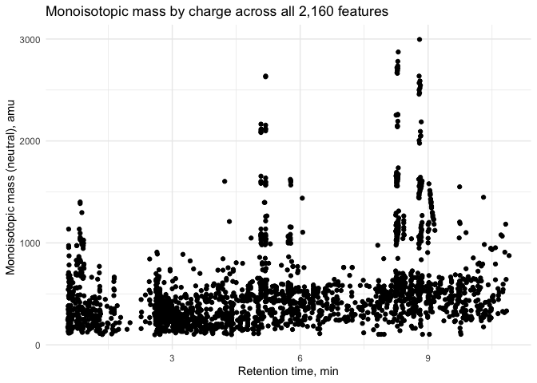<!-- -->

Retention time range

``` r
range(Data_tidy_sep$rt)
```

    ## [1]  0.55 10.90

Mass range as a histogram

``` r
feature_mz_rt_sep %>%
  ggplot(aes(x = mz)) +
  geom_histogram(binwidth = 25) +
  theme_minimal() +
  labs(x = "Monoisotopic mass (amu)",
       y = "Number of features",
       title = "Distribution of features by mass")
```

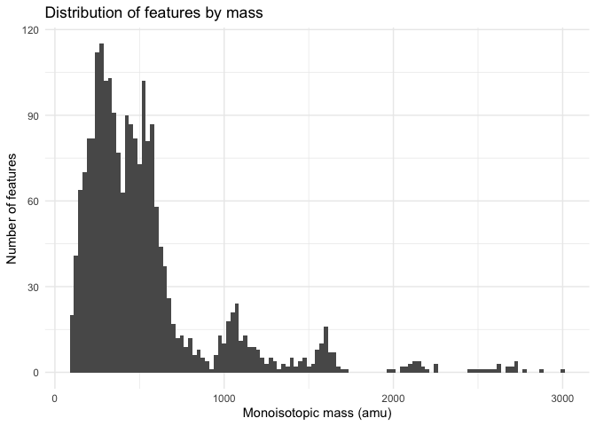<!-- -->

Retention time as a histogram

``` r
feature_mz_rt_sep %>%
  ggplot(aes(x = rt)) +
  geom_histogram(binwidth = 0.1) + # 6 second bins
  theme_minimal() +
  labs(x = "Retention time",
       y = "Number of features",
       title = "Distribution of features by retention time")
```

<!-- -->

## Missing values and imputing

### Missing values

How many missing values are there?

``` r
# all data including QCs
NAbyColumn <- colSums(is.na(Data))

hist(NAbyColumn,
     breaks = 42, # because there are 42 samples
     xlab = "Number of missing values",
     ylab = "Number of metabolites",
     main = "How many missing values are there?")
```

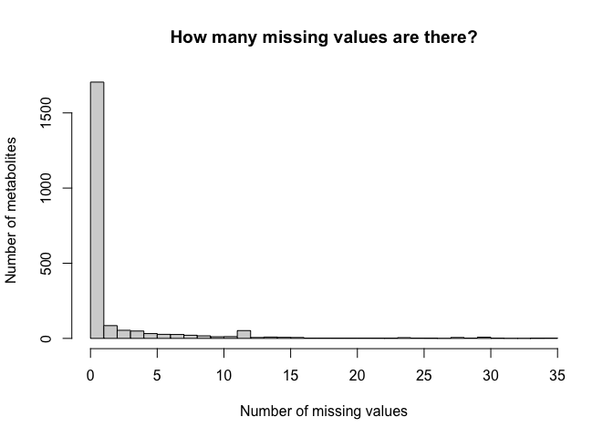<!-- -->

``` r
# samples only (no QCs)
Data_noQC <- Data %>%
  filter(Class != "QC")

NAbyColumn_noQC <- colSums(is.na(Data_noQC))

hist(NAbyColumn_noQC,
     breaks = 35, # because there are 35 samples
     xlab = "Number of missing values",
     ylab = "Number of metabolites",
     main = "How many missing values are there in the samples?")
```

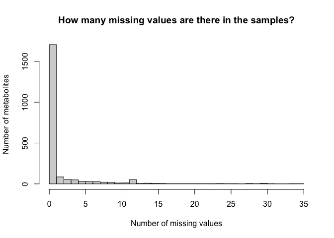<!-- -->

Peak at 11 looks like features that are absent from just the control
group

How many missing values are there in the QCs?

``` r
Data_QC <- Data %>%
  filter(Class == "QC") 

NAbyColumn_QC <- colSums(is.na(Data_QC))

# are there any missing values in the QCs?
sum(NAbyColumn_QC) #no
```

    ## [1] 0

### Removing samples with lots of missingness

``` r
# calculate how many NAs there are per feature
contains_NAs <- Data_noQC %>%
  pivot_longer(cols = 3:ncol(.),
               names_to = "mz_rt",
               values_to = "rel_abund") %>%
  group_by(mz_rt) %>%
  count(is.na(rel_abund)) %>%
  filter(`is.na(rel_abund)` == TRUE)

contains_24_or_more_NAs <- contains_NAs %>%
  filter(n >= 24)

# calculate how many NAs there are per feature for each Class
# only includes features for which there is at least 1 NA
NAs_by_Class <- Data_noQC %>%
  select(-ID) %>%
  group_by(Class) %>%
  summarise_all(funs(sum(is.na(.)))) %>% # how many NAs
  select(Class, all_of(contains_NAs$mz_rt)) # include only features that have NAs
```

    ## Warning: `funs()` was deprecated in dplyr 0.8.0.
    ## ℹ Please use a list of either functions or lambdas:
    ## 
    ## # Simple named list: list(mean = mean, median = median)
    ## 
    ## # Auto named with `tibble::lst()`: tibble::lst(mean, median)
    ## 
    ## # Using lambdas list(~ mean(., trim = .2), ~ median(., na.rm = TRUE))
    ## Call `lifecycle::last_lifecycle_warnings()` to see where this warning was
    ## generated.

``` r
# 24 is total n (35) minus 11 (smallest group)
at_least_24_missing <- NAs_by_Class %>%
  select(Class, all_of(contains_24_or_more_NAs$mz_rt))

# which features contain no missing data for at least 1 group?
# number_zeroes = 2 means there were 2 Classes that had no missing data
# number_zeroes = 1 means there was 1 Class that had no missing data
# number_zeroes = 0 means all Classes has at least 1 missing datapoint
# we want to retain all features that have 1 or 2 Classes with no missing data
# those with 0 we want to look closer at
missing_data_by_Class <- sapply(NAs_by_Class[,-1], # remove Class
                  function(x){length(which(x == 0)/length(x))}) %>%
  as.data.frame() %>%
  rownames_to_column(var = "mz_rt") %>%
  rename(number_zeroes = 2)

features_with_no_complete_data <- missing_data_by_Class %>%
  filter(number_zeroes == 0)

features_with_no_complete_data_by_Class <- NAs_by_Class %>%
  select(Class, all_of(features_with_no_complete_data$mz_rt))

df_features_to_remove <- features_with_no_complete_data_by_Class %>%
  select(-Class) %>%
  colSums() %>%
  as.data.frame() %>%
  rownames_to_column(var = "mz_rt") %>%
  rename(num_missing_values = 2) %>%
  filter(num_missing_values >= 24)

Data_filtered <- Data %>%
  select(ID, Class, !all_of(df_features_to_remove$mz_rt))

dim(Data_filtered)
```

    ## [1]   42 2135

### Untransformed data

#### Data quality boxplot

Wrangle.

``` r
# create long df 
Data_filtered_tidy <- Data_filtered %>%
  pivot_longer(cols = 3:ncol(.),
               names_to = "mz_rt",
               values_to = "rel_abund")

# check structure
str(Data_filtered_tidy)
```

    ## tibble [89,586 × 4] (S3: tbl_df/tbl/data.frame)
    ##  $ ID       : chr [1:89586] "NM_15_120" "NM_15_120" "NM_15_120" "NM_15_120" ...
    ##  $ Class    : chr [1:89586] "Control" "Control" "Control" "Control" ...
    ##  $ mz_rt    : chr [1:89586] "441.287_4.83" "444.9379_1.2" "297.2663_7.29" "330.2383_6.45" ...
    ##  $ rel_abund: num [1:89586] NA 32081 113826 300218 15170 ...

``` r
# convert Class to factor and set levels 
Data_filtered_tidy$Class <- factor(Data_filtered_tidy$Class,
                                   levels = c("Control", "Red", "Tangerine", "QC"))


# reorder ID so its in Class order
Data_filtered_tidy <- Data_filtered_tidy %>%
  arrange(Class) %>%
  mutate(ID = fct_inorder(ID))
```

Plot.

``` r
Data_filtered_tidy %>%
  ggplot(aes(x = ID, y = rel_abund, fill = Class)) +
  geom_boxplot(alpha = 0.6) +
  scale_fill_manual(values = c("black", "#941100", "#FF9300", "light grey")) +
  theme_minimal() +
  theme(axis.text.x = element_text(angle = 90)) +
  labs(title = "LC-MS (+) Feature Abundances by Sample",
       subtitle = "Data is unscaled",
       y = "Relative abundance")
```

    ## Warning: Removed 3116 rows containing non-finite values (`stat_boxplot()`).

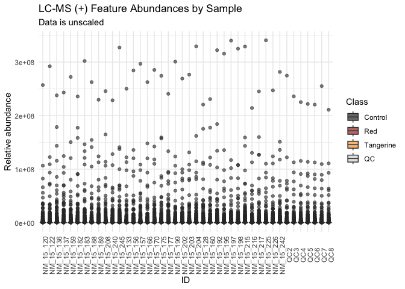<!-- -->

Super we can’t see anything. Will need to log transform.

### Log2 transform

``` r
# log2 transform values that are not zero or NA (keep zeroes as 0, and convert NA to 0)
Data_filtered_tidy_log2 <- Data_filtered_tidy %>%
  mutate(rel_abund_log2 = if_else(rel_abund > 0, log2(rel_abund), 0)) %>%
  replace(is.na(.), 0)
```

#### Data quality boxplot

Plot.

``` r
(data_quality <- Data_filtered_tidy_log2 %>%
  ggplot(aes(x = ID, y = rel_abund_log2, fill = Class)) +
  geom_boxplot(alpha = 0.6) +
  scale_fill_manual(values = c("black", "#941100", "#FF9300", "light grey")) +
  theme_minimal() +
  theme(axis.text.x = element_text(angle = 90)) +
  labs(title = "LC-MS (+) Feature Abundances by Sample",
       subtitle = "Data is log2 transformed"))
```

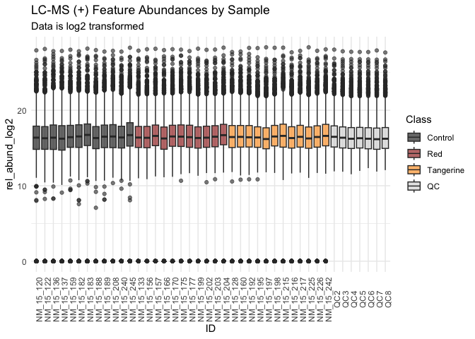<!-- -->

``` r
ggsave(plot = data_quality,
       filename = "figs/data_quality_boxplot_log2.svg")
```

## PCA: Control, Red, Tangerine

### With QCs

Wrangle

``` r
# go back to wide data
Data_filtered_log2 <- Data_filtered_tidy_log2 %>%
  select(ID, Class, mz_rt, rel_abund_log2) %>%
  pivot_wider(names_from = mz_rt, 
              values_from = rel_abund_log2)

Data_filtered_log2.PCA <- PCA(Data_filtered_log2, # wide data
                               quali.sup=1:2, # remove qualitative variables
                               graph=FALSE, # don't graph
                               scale.unit=FALSE) # don't scale, we already did this

# look at summary
summary(Data_filtered_log2.PCA)
```

    ## 
    ## Call:
    ## PCA(X = Data_filtered_log2, scale.unit = FALSE, quali.sup = 1:2,  
    ##      graph = FALSE) 
    ## 
    ## 
    ## Eigenvalues
    ##                         Dim.1    Dim.2    Dim.3    Dim.4    Dim.5    Dim.6
    ## Variance             3923.675 1316.103  983.934  870.409  540.741  501.851
    ## % of var.              25.895    8.686    6.494    5.744    3.569    3.312
    ## Cumulative % of var.   25.895   34.581   41.075   46.819   50.388   53.700
    ##                         Dim.7    Dim.8    Dim.9   Dim.10   Dim.11   Dim.12
    ## Variance              482.022  465.175  401.452  378.955  334.101  326.971
    ## % of var.               3.181    3.070    2.649    2.501    2.205    2.158
    ## Cumulative % of var.   56.881   59.951   62.601   65.102   67.307   69.464
    ##                        Dim.13   Dim.14   Dim.15   Dim.16   Dim.17   Dim.18
    ## Variance              308.619  298.731  289.461  281.767  260.035  254.241
    ## % of var.               2.037    1.972    1.910    1.860    1.716    1.678
    ## Cumulative % of var.   71.501   73.473   75.383   77.243   78.959   80.637
    ##                        Dim.19   Dim.20   Dim.21   Dim.22   Dim.23   Dim.24
    ## Variance              251.816  234.616  216.452  209.552  197.777  191.041
    ## % of var.               1.662    1.548    1.429    1.383    1.305    1.261
    ## Cumulative % of var.   82.299   83.847   85.276   86.659   87.964   89.225
    ##                        Dim.25   Dim.26   Dim.27   Dim.28   Dim.29   Dim.30
    ## Variance              182.797  171.210  170.956  163.023  149.863  144.297
    ## % of var.               1.206    1.130    1.128    1.076    0.989    0.952
    ## Cumulative % of var.   90.431   91.561   92.689   93.765   94.754   95.707
    ##                        Dim.31   Dim.32   Dim.33   Dim.34   Dim.35   Dim.36
    ## Variance              136.033  134.367  127.064  120.801  114.684    8.305
    ## % of var.               0.898    0.887    0.839    0.797    0.757    0.055
    ## Cumulative % of var.   96.604   97.491   98.330   99.127   99.884   99.939
    ##                        Dim.37   Dim.38   Dim.39   Dim.40   Dim.41
    ## Variance                2.709    2.189    1.669    1.517    1.217
    ## % of var.               0.018    0.014    0.011    0.010    0.008
    ## Cumulative % of var.   99.956   99.971   99.982   99.992  100.000
    ## 
    ## Individuals (the 10 first)
    ##                       Dist      Dim.1      ctr     cos2      Dim.2      ctr
    ## 1               |  170.148 | -113.707    7.846    0.447 |  -63.864    7.379
    ## 2               |  141.632 |  -93.459    5.300    0.435 |   29.461    1.570
    ## 3               |  169.818 | -113.607    7.832    0.448 |  -13.098    0.310
    ## 4               |  198.505 | -128.815   10.069    0.421 |  -90.936   14.960
    ## 5               |  131.230 |  -84.508    4.334    0.415 |   43.134    3.366
    ## 6               |  132.076 |  -87.826    4.681    0.442 |   23.671    1.014
    ## 7               |  161.246 |  -86.486    4.539    0.288 |   59.689    6.445
    ## 8               |  138.588 |  -88.081    4.708    0.404 |   37.408    2.532
    ## 9               |  137.198 |  -85.727    4.460    0.390 |   43.691    3.453
    ## 10              |  154.842 |  -90.432    4.963    0.341 |   52.823    5.048
    ##                     cos2      Dim.3      ctr     cos2  
    ## 1                  0.141 |  -32.140    2.500    0.036 |
    ## 2                  0.043 |  -54.881    7.288    0.150 |
    ## 3                  0.006 |  -30.873    2.307    0.033 |
    ## 4                  0.210 |   59.572    8.588    0.090 |
    ## 5                  0.108 |    7.334    0.130    0.003 |
    ## 6                  0.032 |  -37.670    3.434    0.081 |
    ## 7                  0.137 |   17.961    0.781    0.012 |
    ## 8                  0.073 |    7.279    0.128    0.003 |
    ## 9                  0.101 |   37.731    3.445    0.076 |
    ## 10                 0.116 |   36.678    3.255    0.056 |
    ## 
    ## Variables (the 10 first)
    ##                    Dim.1    ctr   cos2    Dim.2    ctr   cos2    Dim.3    ctr
    ## 441.287_4.83    |  6.120  0.955  0.946 | -1.018  0.079  0.026 | -0.435  0.019
    ## 444.9379_1.2    |  1.607  0.066  0.141 |  0.946  0.068  0.049 | -0.788  0.063
    ## 297.2663_7.29   | -0.007  0.000  0.000 |  0.007  0.000  0.000 | -0.183  0.003
    ## 330.2383_6.45   | -0.075  0.000  0.017 | -0.111  0.001  0.037 | -0.143  0.002
    ## 494.185_5.18    | -0.037  0.000  0.002 |  0.027  0.000  0.001 | -0.245  0.006
    ## 908.6393_10.8   |  0.389  0.004  0.112 |  0.411  0.013  0.125 |  0.018  0.000
    ## 590.258_8.82    |  0.088  0.000  0.064 |  0.119  0.001  0.115 |  0.003  0.000
    ## 588.3586_10.41  | -0.042  0.000  0.002 | -0.135  0.001  0.025 |  0.182  0.003
    ## 269.3081_8.99   |  0.426  0.005  0.032 | -0.631  0.030  0.070 | -0.368  0.014
    ## 515.233_8.4     | -0.189  0.001  0.177 | -0.072  0.000  0.026 | -0.014  0.000
    ##                   cos2  
    ## 441.287_4.83     0.005 |
    ## 444.9379_1.2     0.034 |
    ## 297.2663_7.29    0.093 |
    ## 330.2383_6.45    0.061 |
    ## 494.185_5.18     0.105 |
    ## 908.6393_10.8    0.000 |
    ## 590.258_8.82     0.000 |
    ## 588.3586_10.41   0.045 |
    ## 269.3081_8.99    0.024 |
    ## 515.233_8.4      0.001 |
    ## 
    ## Supplementary categories (the 10 first)
    ##                       Dist      Dim.1     cos2   v.test      Dim.2     cos2
    ## NM_15_120       |  170.148 | -113.707    0.447   -1.815 |  -63.864    0.141
    ## NM_15_122       |  141.632 |  -93.459    0.435   -1.492 |   29.461    0.043
    ## NM_15_136       |  169.818 | -113.607    0.448   -1.814 |  -13.098    0.006
    ## NM_15_137       |  198.505 | -128.815    0.421   -2.056 |  -90.936    0.210
    ## NM_15_159       |  131.230 |  -84.508    0.415   -1.349 |   43.134    0.108
    ## NM_15_182       |  132.076 |  -87.826    0.442   -1.402 |   23.671    0.032
    ## NM_15_183       |  161.246 |  -86.486    0.288   -1.381 |   59.689    0.137
    ## NM_15_188       |  138.588 |  -88.081    0.404   -1.406 |   37.408    0.073
    ## NM_15_189       |  137.198 |  -85.727    0.390   -1.369 |   43.691    0.101
    ## NM_15_208       |  154.842 |  -90.432    0.341   -1.444 |   52.823    0.116
    ##                   v.test      Dim.3     cos2   v.test  
    ## NM_15_120         -1.760 |  -32.140    0.036   -1.025 |
    ## NM_15_122          0.812 |  -54.881    0.150   -1.750 |
    ## NM_15_136         -0.361 |  -30.873    0.033   -0.984 |
    ## NM_15_137         -2.507 |   59.572    0.090    1.899 |
    ## NM_15_159          1.189 |    7.334    0.003    0.234 |
    ## NM_15_182          0.652 |  -37.670    0.081   -1.201 |
    ## NM_15_183          1.645 |   17.961    0.012    0.573 |
    ## NM_15_188          1.031 |    7.279    0.003    0.232 |
    ## NM_15_189          1.204 |   37.731    0.076    1.203 |
    ## NM_15_208          1.456 |   36.678    0.056    1.169 |

``` r
# pull PC coordinates into df
PC_coord_QC_log2 <- as.data.frame(Data_filtered_log2.PCA$ind$coord)

# bind back metadata in cols 1 and 2
PC_coord_QC_log2 <- bind_cols(Data_filtered_log2[,1:2], PC_coord_QC_log2)

# grab some variance explained
importance_QC <- Data_filtered_log2.PCA$eig

# set variance explained with PC1, round to 2 digits
PC1_withQC <- round(importance_QC[1,2], 2)

# set variance explained with PC1, round to 2 digits
PC2_withQC <- round(importance_QC[2,2], 2)
```

Final filtered dataset, in Supplemental Table 13.

``` r
write_csv(Data_filtered_log2,
          file = "LiverTomatoMetabolomics_Log2Filtered_SupplTable13.csv")
```

Plot with `FactoExtra`

``` r
# scree plot
fviz_eig(Data_filtered_log2.PCA)
```

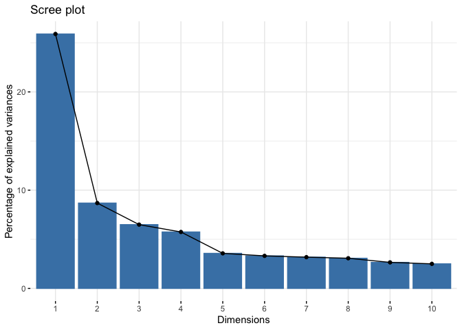<!-- -->

``` r
# scores plot
fviz_pca_ind(Data_filtered_log2.PCA)
```

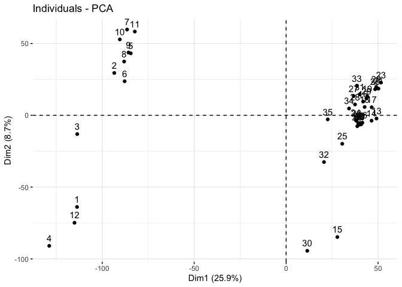<!-- -->

``` r
# loadings
fviz_pca_var(Data_filtered_log2.PCA) # nightmare
```

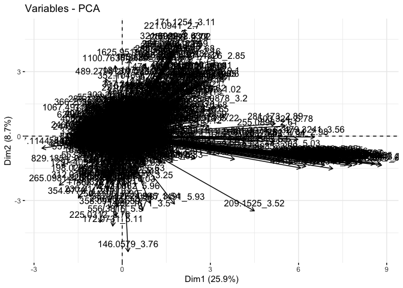<!-- -->

Plot manually

``` r
(PCA_withQCs <- PC_coord_QC_log2 %>%
  ggplot(aes(x = Dim.1, y = Dim.2,
             fill = factor(Class, levels = c("Control", "Red", "Tangerine", "QC")))) +
  geom_point(shape = 21, alpha = 0.6) +
  scale_fill_manual(values = c("black", "#941100", "#FF9300", "light grey")) +
  scale_color_manual(values = "black") +  
  theme_minimal() +
  coord_fixed(PC2_withQC/PC1_withQC) +
  labs(x = glue::glue("PC1: {PC1_withQC}%"),
       y = glue::glue("PC2: {PC2_withQC}%"),
       fill = "Group",
       title = "Principal Components Analysis Scores Plot"))
```

<!-- -->

Save

``` r
ggsave(plot = PCA_withQCs,
       filename = "figs/PCA_withQCs.svg")
```

### Without QCs

Wrangle

``` r
Data_filtered_log2_noQC <- Data_filtered_log2 %>%
  filter(Class != "QC")

Data_filtered_log2_noQC.PCA <- PCA(Data_filtered_log2_noQC, # wide data
                               quali.sup=1:2, # remove qualitative variables
                               graph=FALSE, # don't graph
                               scale.unit=FALSE) # don't scale, we already did this

# look at summary
summary(Data_filtered_log2_noQC.PCA)
```

    ## 
    ## Call:
    ## PCA(X = Data_filtered_log2_noQC, scale.unit = FALSE, quali.sup = 1:2,  
    ##      graph = FALSE) 
    ## 
    ## 
    ## Eigenvalues
    ##                         Dim.1    Dim.2    Dim.3    Dim.4    Dim.5    Dim.6
    ## Variance             4380.745 1574.454 1098.828  914.439  648.467  593.510
    ## % of var.              25.519    9.172    6.401    5.327    3.777    3.457
    ## Cumulative % of var.   25.519   34.690   41.091   46.418   50.196   53.653
    ##                         Dim.7    Dim.8    Dim.9   Dim.10   Dim.11   Dim.12
    ## Variance              559.687  503.845  467.073  439.325  400.201  371.282
    ## % of var.               3.260    2.935    2.721    2.559    2.331    2.163
    ## Cumulative % of var.   56.913   59.848   62.569   65.128   67.459   69.622
    ##                        Dim.13   Dim.14   Dim.15   Dim.16   Dim.17   Dim.18
    ## Variance              359.332  355.149  344.577  314.120  307.658  302.172
    ## % of var.               2.093    2.069    2.007    1.830    1.792    1.760
    ## Cumulative % of var.   71.715   73.784   75.792   77.621   79.414   81.174
    ##                        Dim.19   Dim.20   Dim.21   Dim.22   Dim.23   Dim.24
    ## Variance              283.435  269.831  252.432  237.659  231.708  228.195
    ## % of var.               1.651    1.572    1.470    1.384    1.350    1.329
    ## Cumulative % of var.   82.825   84.397   85.867   87.252   88.601   89.931
    ##                        Dim.25   Dim.26   Dim.27   Dim.28   Dim.29   Dim.30
    ## Variance              206.968  205.266  196.056  182.756  173.129  163.717
    ## % of var.               1.206    1.196    1.142    1.065    1.009    0.954
    ## Cumulative % of var.   91.136   92.332   93.474   94.539   95.547   96.501
    ##                        Dim.31   Dim.32   Dim.33   Dim.34
    ## Variance              162.856  153.526  144.956  139.356
    ## % of var.               0.949    0.894    0.844    0.812
    ## Cumulative % of var.   97.449   98.344   99.188  100.000
    ## 
    ## Individuals (the 10 first)
    ##                       Dist      Dim.1      ctr     cos2      Dim.2      ctr
    ## 1               |  165.434 | -106.691    7.424    0.416 |  -63.951    7.421
    ## 2               |  135.452 |  -83.263    4.522    0.378 |   27.296    1.352
    ## 3               |  163.506 | -102.862    6.901    0.396 |  -15.666    0.445
    ## 4               |  194.627 | -124.008   10.030    0.406 |  -88.237   14.129
    ## 5               |  126.387 |  -76.638    3.831    0.368 |   43.368    3.413
    ## 6               |  126.685 |  -79.222    4.093    0.391 |   22.654    0.931
    ## 7               |  157.657 |  -79.664    4.139    0.255 |   61.281    6.815
    ## 8               |  134.228 |  -81.008    4.280    0.364 |   38.273    2.658
    ## 9               |  134.449 |  -81.264    4.307    0.365 |   46.563    3.934
    ## 10              |  150.264 |  -82.408    4.429    0.301 |   53.817    5.256
    ##                     cos2      Dim.3      ctr     cos2  
    ## 1                  0.149 |   54.856    7.824    0.110 |
    ## 2                  0.041 |   59.361    9.162    0.192 |
    ## 3                  0.009 |  -22.093    1.269    0.018 |
    ## 4                  0.206 |  -79.586   16.470    0.167 |
    ## 5                  0.118 |  -13.978    0.508    0.012 |
    ## 6                  0.032 |   50.038    6.510    0.156 |
    ## 7                  0.151 |    9.166    0.218    0.003 |
    ## 8                  0.081 |    3.019    0.024    0.001 |
    ## 9                  0.120 |  -16.014    0.667    0.014 |
    ## 10                 0.128 |  -52.097    7.057    0.120 |
    ## 
    ## Variables (the 10 first)
    ##                    Dim.1    ctr   cos2    Dim.2    ctr   cos2    Dim.3    ctr
    ## 441.287_4.83    |  6.531  0.974  0.948 | -1.203  0.092  0.032 | -0.136  0.002
    ## 444.9379_1.2    |  1.647  0.062  0.126 |  1.039  0.069  0.050 |  2.215  0.447
    ## 297.2663_7.29   |  0.070  0.000  0.018 | -0.014  0.000  0.001 |  0.067  0.000
    ## 330.2383_6.45   | -0.045  0.000  0.006 | -0.133  0.001  0.053 |  0.098  0.001
    ## 494.185_5.18    |  0.056  0.000  0.006 |  0.002  0.000  0.000 |  0.230  0.005
    ## 908.6393_10.8   |  0.392  0.004  0.098 |  0.453  0.013  0.132 |  0.037  0.000
    ## 590.258_8.82    |  0.090  0.000  0.071 |  0.130  0.001  0.150 |  0.030  0.000
    ## 588.3586_10.41  | -0.028  0.000  0.001 | -0.150  0.001  0.026 | -0.406  0.015
    ## 269.3081_8.99   |  0.534  0.007  0.042 | -0.735  0.034  0.080 | -0.043  0.000
    ## 515.233_8.4     | -0.198  0.001  0.183 | -0.081  0.000  0.031 | -0.033  0.000
    ##                   cos2  
    ## 441.287_4.83     0.000 |
    ## 444.9379_1.2     0.227 |
    ## 297.2663_7.29    0.016 |
    ## 330.2383_6.45    0.029 |
    ## 494.185_5.18     0.101 |
    ## 908.6393_10.8    0.001 |
    ## 590.258_8.82     0.008 |
    ## 588.3586_10.41   0.193 |
    ## 269.3081_8.99    0.000 |
    ## 515.233_8.4      0.005 |
    ## 
    ## Supplementary categories (the 10 first)
    ##                       Dist      Dim.1     cos2   v.test      Dim.2     cos2
    ## NM_15_120       |  165.434 | -106.691    0.416   -1.612 |  -63.951    0.149
    ## NM_15_122       |  135.452 |  -83.263    0.378   -1.258 |   27.296    0.041
    ## NM_15_136       |  163.506 | -102.862    0.396   -1.554 |  -15.666    0.009
    ## NM_15_137       |  194.627 | -124.008    0.406   -1.874 |  -88.237    0.206
    ## NM_15_159       |  126.387 |  -76.638    0.368   -1.158 |   43.368    0.118
    ## NM_15_182       |  126.685 |  -79.222    0.391   -1.197 |   22.654    0.032
    ## NM_15_183       |  157.657 |  -79.664    0.255   -1.204 |   61.281    0.151
    ## NM_15_188       |  134.228 |  -81.008    0.364   -1.224 |   38.273    0.081
    ## NM_15_189       |  134.449 |  -81.264    0.365   -1.228 |   46.563    0.120
    ## NM_15_208       |  150.264 |  -82.408    0.301   -1.245 |   53.817    0.128
    ##                   v.test      Dim.3     cos2   v.test  
    ## NM_15_120         -1.612 |   54.856    0.110    1.655 |
    ## NM_15_122          0.688 |   59.361    0.192    1.791 |
    ## NM_15_136         -0.395 |  -22.093    0.018   -0.666 |
    ## NM_15_137         -2.224 |  -79.586    0.167   -2.401 |
    ## NM_15_159          1.093 |  -13.978    0.012   -0.422 |
    ## NM_15_182          0.571 |   50.038    0.156    1.510 |
    ## NM_15_183          1.544 |    9.166    0.003    0.277 |
    ## NM_15_188          0.965 |    3.019    0.001    0.091 |
    ## NM_15_189          1.173 |  -16.014    0.014   -0.483 |
    ## NM_15_208          1.356 |  -52.097    0.120   -1.572 |

``` r
# pull PC coordinates into df
PC_coord_log2 <- as.data.frame(Data_filtered_log2_noQC.PCA$ind$coord)

# bind back metadata in cols 1 and 2
PC_coord_log2 <- bind_cols(Data_filtered_log2_noQC[,1:2], PC_coord_log2)

# grab some variance explained
importance_noQC <- Data_filtered_log2_noQC.PCA$eig

# set variance explained with PC1, round to 2 digits
PC1_noQC <- round(importance_noQC[1,2], 2)

# set variance explained with PC1, round to 2 digits
PC2_noQC <- round(importance_noQC[2,2], 2)
```

Plot with `FactoExtra`

``` r
# scree plot
fviz_eig(Data_filtered_log2_noQC.PCA)
```

<!-- -->

``` r
# scores plot
fviz_pca_ind(Data_filtered_log2_noQC.PCA)
```

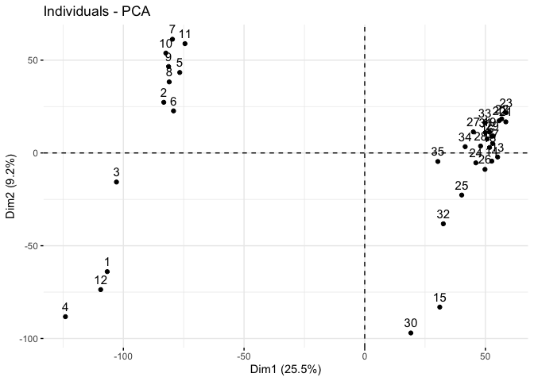<!-- -->

``` r
# loadings
fviz_pca_var(Data_filtered_log2_noQC.PCA) # nightmare
```

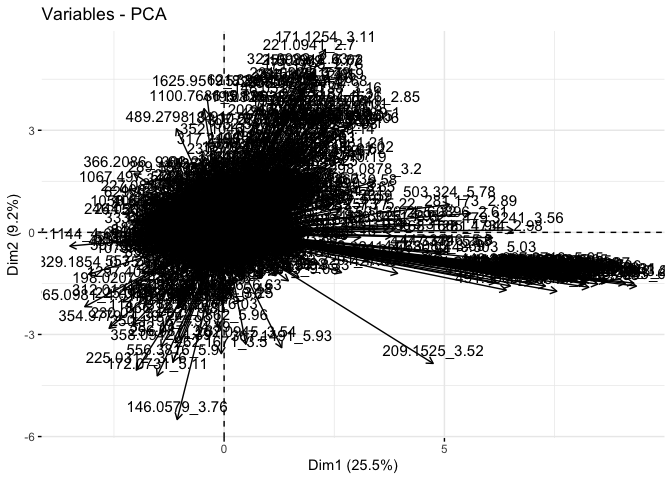<!-- -->

Plot manually

``` r
PCA_withoutQCs <-  PC_coord_log2 %>%
  ggplot(aes(x = Dim.1, y = Dim.2,
             fill = factor(Class, levels = c("Control", "Red", "Tangerine")))) +
  geom_point(shape = 21, alpha = 0.6) +
  scale_fill_manual(values = c("black", "#941100", "#FF9300")) +
  scale_color_manual(values = "black") +  
  theme_minimal() +
  coord_fixed(PC2_withQC/PC1_withQC) +
  labs(x = glue::glue("PC1: {PC1_noQC}%"),
       y = glue::glue("PC2: {PC2_noQC}%"),
       fill = "Diet",
       title = "Principal Components Analysis Scores Plot")
```

Save

``` r
ggsave(plot = PCA_withoutQCs,
       filename = "figs/PCA_withoutQCs.svg")
```

## PCA: Control vs Tomato

Wrangle

``` r
# remove QCs
# make new column called Tomato
# move Tomato towards the front of the df
Data_filtered_log2_noQC_ctrl_tomato <- Data_filtered_log2_noQC %>%
  filter(Class != "QC") %>%
  mutate(Tomato = if_else(Class == "Control", "Control", "Tomato")) %>%
  select(ID, Class, Tomato, everything())

# bind back metadata in cols 1,2,3
PC_coord_noQC_Tomato <- bind_cols(Data_filtered_log2_noQC_ctrl_tomato[,1:3],
                                            Data_filtered_log2_noQC.PCA$ind$coord)
```

Plot manually

``` r
(PCA_control_tomato <- PC_coord_noQC_Tomato %>%
  ggplot(aes(x = Dim.1, y = Dim.2,
             fill = factor(Tomato, levels = c("Control", "Tomato")))) +
  geom_point(shape = 21, alpha = 0.6) +
  scale_fill_manual(values = c("black", "tomato")) +
  scale_color_manual(values = "black") +  
  theme_minimal() +
  coord_fixed(PC2_withQC/PC1_withQC) +
  labs(x = glue::glue("PC1: {PC1_noQC}%"),
       y = glue::glue("PC2: {PC2_noQC}%"),
       fill = "Diet",
       title = "Principal Components Analysis Scores Plot"))
```

<!-- -->

Save

``` r
ggsave(plot = PCA_withoutQCs,
       filename = "figs/PCA_withoutQCs.svg")
```

## Kmeans clustering

First we want to determine heuristically how many clusters there are,
going up to 10 clusters. Then will save total within sum of squares to
wss variable. Nstart is the number of iterations.

``` r
# remove metadata
for_kmeans <- Data_filtered_log2_noQC_ctrl_tomato %>%
  select(-ID, -Class, -Tomato)

# calculate within cluster sum of squared errors wss
wss <- vector()
for (i in 1:10) {
  liver_pos_kmeans <- kmeans(for_kmeans, centers = i, nstart = 20)
  wss[i] <- liver_pos_kmeans$tot.withinss
}
```

Making a scree plot to determine how many clusters we should have.

``` r
plot(1:10, wss, type = "b", 
     xlab = "Number of Clusters", 
     ylab = "Within groups sum of squares")
```

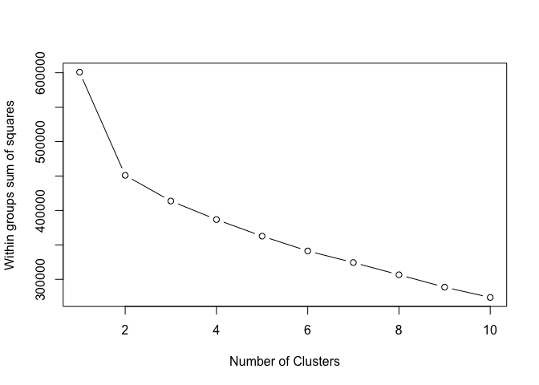<!-- -->

Setting the number of cluster I guess I will call this “elbow” at 3, but
its not a super obvious 3. We are looking for the elbow of the plot.

``` r
k <- 3 # use for control vs red vs tangerine
j <- 2 # use for control vs tomato
```

### Control vs red vs tangerine, for k = 3 clusters

Look up what nstart means again

``` r
liver_pos_kmeans_3 <- kmeans(for_kmeans, 
                             centers = k, 
                             nstart = 20, 
                             iter.max = 200)
summary(liver_pos_kmeans_3)
```

    ##              Length Class  Mode   
    ## cluster        35   -none- numeric
    ## centers      6399   -none- numeric
    ## totss           1   -none- numeric
    ## withinss        3   -none- numeric
    ## tot.withinss    1   -none- numeric
    ## betweenss       1   -none- numeric
    ## size            3   -none- numeric
    ## iter            1   -none- numeric
    ## ifault          1   -none- numeric

Which mouse is in which cluster?

``` r
liver_pos_kmeans_3$cluster # grab the cluster classification from the kmeans object
```

    ##  [1] 2 3 2 2 3 3 3 3 3 3 3 2 1 1 1 1 1 1 1 1 1 1 1 1 1 1 1 1 1 1 1 1 1 1 1

``` r
# Add the cluster group to the parent datafile
PC_coord_noQC_Tomato_withclust <- PC_coord_noQC_Tomato %>%
  mutate(kmeans_controlredtang = liver_pos_kmeans_3$cluster)

# reorder so kmeans cluster is towards the beginning
PC_coord_noQC_Tomato_withclust <- PC_coord_noQC_Tomato_withclust %>%
  select(ID, Class, Tomato, kmeans_controlredtang, everything())

# check the reordering
knitr::kable(PC_coord_noQC_Tomato_withclust[1:35, 1:7])
```

| ID        | Class     | Tomato  | kmeans_controlredtang |      Dim.1 |      Dim.2 |       Dim.3 |
|:----------|:----------|:--------|----------------------:|-----------:|-----------:|------------:|
| NM_15_120 | Control   | Control |                     2 | -106.69123 | -63.950604 |  54.8563452 |
| NM_15_122 | Control   | Control |                     3 |  -83.26293 |  27.295606 |  59.3606851 |
| NM_15_136 | Control   | Control |                     2 | -102.86240 | -15.666217 | -22.0925074 |
| NM_15_137 | Control   | Control |                     2 | -124.00761 | -88.237037 | -79.5864276 |
| NM_15_159 | Control   | Control |                     3 |  -76.63817 |  43.367786 | -13.9779652 |
| NM_15_182 | Control   | Control |                     3 |  -79.22179 |  22.654052 |  50.0381868 |
| NM_15_183 | Control   | Control |                     3 |  -79.66365 |  61.281011 |   9.1656935 |
| NM_15_188 | Control   | Control |                     3 |  -81.00790 |  38.273068 |   3.0187213 |
| NM_15_189 | Control   | Control |                     3 |  -81.26408 |  46.562943 | -16.0139043 |
| NM_15_208 | Control   | Control |                     3 |  -82.40790 |  53.817188 | -52.0968788 |
| NM_15_240 | Control   | Control |                     3 |  -74.47243 |  58.888206 |  -1.1349561 |
| NM_15_245 | Control   | Control |                     2 | -109.39649 | -73.658139 |  15.3981372 |
| NM_15_133 | Red       | Tomato  |                     1 |   55.06492 |  -2.200242 | -45.8084880 |
| NM_15_156 | Red       | Tomato  |                     1 |   52.65783 |  -4.410859 | -27.5927524 |
| NM_15_157 | Red       | Tomato  |                     1 |   31.09156 | -83.068239 | -39.0932026 |
| NM_15_166 | Red       | Tomato  |                     1 |   50.78199 |   7.554109 | -14.4699484 |
| NM_15_170 | Red       | Tomato  |                     1 |   52.98875 |   5.073934 | -17.8379015 |
| NM_15_175 | Red       | Tomato  |                     1 |   51.72179 |   2.952307 |  20.9108326 |
| NM_15_177 | Red       | Tomato  |                     1 |   51.71825 |  11.324129 |  29.2692077 |
| NM_15_199 | Red       | Tomato  |                     1 |   55.71324 |  17.367036 |  -1.0071316 |
| NM_15_202 | Red       | Tomato  |                     1 |   58.46517 |  16.763677 |  20.9763556 |
| NM_15_203 | Red       | Tomato  |                     1 |   56.74781 |  18.370540 |  -0.8519130 |
| NM_15_204 | Red       | Tomato  |                     1 |   58.60025 |  21.693585 |  15.1095420 |
| NM_15_128 | Tangerine | Tomato  |                     1 |   46.05249 |  -5.339775 | -20.6482830 |
| NM_15_160 | Tangerine | Tomato  |                     1 |   40.18605 | -22.694797 | -65.3355496 |
| NM_15_192 | Tangerine | Tomato  |                     1 |   49.82164 |  -8.853585 |  23.3586725 |
| NM_15_195 | Tangerine | Tomato  |                     1 |   45.00976 |  11.348312 |  13.2339097 |
| NM_15_197 | Tangerine | Tomato  |                     1 |   48.00648 |   3.716988 |  11.6602536 |
| NM_15_198 | Tangerine | Tomato  |                     1 |   52.86770 |   9.018991 |   2.9613740 |
| NM_15_215 | Tangerine | Tomato  |                     1 |   19.10693 | -97.021529 |  69.7214376 |
| NM_15_216 | Tangerine | Tomato  |                     1 |   49.99457 |  10.970353 |  -4.1233865 |
| NM_15_217 | Tangerine | Tomato  |                     1 |   32.56782 | -38.181572 |  31.2699018 |
| NM_15_225 | Tangerine | Tomato  |                     1 |   49.81869 |  16.218783 |  14.7261967 |
| NM_15_226 | Tangerine | Tomato  |                     1 |   41.61857 |   3.378630 | -24.2685280 |
| NM_15_242 | Tangerine | Tomato  |                     1 |   30.29431 |  -4.608642 |   0.9042711 |

### Control vs tomato, for k = 2 clusters

``` r
liver_pos_kmeans_2 <- kmeans(for_kmeans, 
                             centers = j, 
                             nstart = 20, 
                             iter.max = 200)
summary(liver_pos_kmeans_2)
```

    ##              Length Class  Mode   
    ## cluster        35   -none- numeric
    ## centers      4266   -none- numeric
    ## totss           1   -none- numeric
    ## withinss        2   -none- numeric
    ## tot.withinss    1   -none- numeric
    ## betweenss       1   -none- numeric
    ## size            2   -none- numeric
    ## iter            1   -none- numeric
    ## ifault          1   -none- numeric

Which mouse is in which cluster?

``` r
liver_pos_kmeans_2$cluster # grab the cluster classification from the kmeans object
```

    ##  [1] 1 1 1 1 1 1 1 1 1 1 1 1 2 2 2 2 2 2 2 2 2 2 2 2 2 2 2 2 2 2 2 2 2 2 2

``` r
# Add the cluster group to the parent datafile
PC_coord_noQC_Tomato_withclust <- PC_coord_noQC_Tomato_withclust %>%
  mutate(kmeans_controltomato = liver_pos_kmeans_2$cluster)

# reorder so kmeans cluster is towards the beginning
PC_coord_noQC_Tomato_withclust <- PC_coord_noQC_Tomato_withclust %>%
  select(ID, Class, Tomato, kmeans_controlredtang, kmeans_controltomato, everything())

# check the reordering
knitr::kable(PC_coord_noQC_Tomato_withclust[1:35, 1:7])
```

| ID        | Class     | Tomato  | kmeans_controlredtang | kmeans_controltomato |      Dim.1 |      Dim.2 |
|:----------|:----------|:--------|----------------------:|---------------------:|-----------:|-----------:|
| NM_15_120 | Control   | Control |                     2 |                    1 | -106.69123 | -63.950604 |
| NM_15_122 | Control   | Control |                     3 |                    1 |  -83.26293 |  27.295606 |
| NM_15_136 | Control   | Control |                     2 |                    1 | -102.86240 | -15.666217 |
| NM_15_137 | Control   | Control |                     2 |                    1 | -124.00761 | -88.237037 |
| NM_15_159 | Control   | Control |                     3 |                    1 |  -76.63817 |  43.367786 |
| NM_15_182 | Control   | Control |                     3 |                    1 |  -79.22179 |  22.654052 |
| NM_15_183 | Control   | Control |                     3 |                    1 |  -79.66365 |  61.281011 |
| NM_15_188 | Control   | Control |                     3 |                    1 |  -81.00790 |  38.273068 |
| NM_15_189 | Control   | Control |                     3 |                    1 |  -81.26408 |  46.562943 |
| NM_15_208 | Control   | Control |                     3 |                    1 |  -82.40790 |  53.817188 |
| NM_15_240 | Control   | Control |                     3 |                    1 |  -74.47243 |  58.888206 |
| NM_15_245 | Control   | Control |                     2 |                    1 | -109.39649 | -73.658139 |
| NM_15_133 | Red       | Tomato  |                     1 |                    2 |   55.06492 |  -2.200242 |
| NM_15_156 | Red       | Tomato  |                     1 |                    2 |   52.65783 |  -4.410859 |
| NM_15_157 | Red       | Tomato  |                     1 |                    2 |   31.09156 | -83.068239 |
| NM_15_166 | Red       | Tomato  |                     1 |                    2 |   50.78199 |   7.554109 |
| NM_15_170 | Red       | Tomato  |                     1 |                    2 |   52.98875 |   5.073934 |
| NM_15_175 | Red       | Tomato  |                     1 |                    2 |   51.72179 |   2.952307 |
| NM_15_177 | Red       | Tomato  |                     1 |                    2 |   51.71825 |  11.324129 |
| NM_15_199 | Red       | Tomato  |                     1 |                    2 |   55.71324 |  17.367036 |
| NM_15_202 | Red       | Tomato  |                     1 |                    2 |   58.46517 |  16.763677 |
| NM_15_203 | Red       | Tomato  |                     1 |                    2 |   56.74781 |  18.370540 |
| NM_15_204 | Red       | Tomato  |                     1 |                    2 |   58.60025 |  21.693585 |
| NM_15_128 | Tangerine | Tomato  |                     1 |                    2 |   46.05249 |  -5.339775 |
| NM_15_160 | Tangerine | Tomato  |                     1 |                    2 |   40.18605 | -22.694797 |
| NM_15_192 | Tangerine | Tomato  |                     1 |                    2 |   49.82164 |  -8.853585 |
| NM_15_195 | Tangerine | Tomato  |                     1 |                    2 |   45.00976 |  11.348312 |
| NM_15_197 | Tangerine | Tomato  |                     1 |                    2 |   48.00648 |   3.716988 |
| NM_15_198 | Tangerine | Tomato  |                     1 |                    2 |   52.86770 |   9.018991 |
| NM_15_215 | Tangerine | Tomato  |                     1 |                    2 |   19.10693 | -97.021529 |
| NM_15_216 | Tangerine | Tomato  |                     1 |                    2 |   49.99457 |  10.970353 |
| NM_15_217 | Tangerine | Tomato  |                     1 |                    2 |   32.56782 | -38.181572 |
| NM_15_225 | Tangerine | Tomato  |                     1 |                    2 |   49.81869 |  16.218783 |
| NM_15_226 | Tangerine | Tomato  |                     1 |                    2 |   41.61857 |   3.378630 |
| NM_15_242 | Tangerine | Tomato  |                     1 |                    2 |   30.29431 |  -4.608642 |

### Superimpose on PCAs

#### 3 clusters

``` r
(PCA_3_kmeans <- PC_coord_noQC_Tomato_withclust %>%
  ggplot(aes(x = Dim.1, y = Dim.2, fill = as.factor(kmeans_controlredtang), shape = Class)) +
  geom_point(alpha = 0.6) +
  scale_shape_manual(values = c(21, 22, 23)) +
  scale_fill_viridis_d() +
  guides(fill = guide_legend(override.aes = list(shape=21))) +
  theme_minimal() +
  coord_fixed(PC2_withQC/PC1_withQC) +
  labs(x = glue::glue("PC1: {PC1_noQC}%"),
       y = glue::glue("PC2: {PC2_noQC}%"),
       fill = "KMeans Cluster",
       title = "Principal Components Analysis Scores Plot",
       subtitle = "Data is colored by K-means cluster (with 3 clusters)"))
```

<!-- -->

``` r
ggsave(plot = PCA_3_kmeans,
       filename = "figs/PCA_3_kmeans.svg")
```

#### 2 clusters

``` r
(PCA_2_kmeans <- PC_coord_noQC_Tomato_withclust %>%
  ggplot(aes(x = Dim.1, y = Dim.2, fill = as.factor(kmeans_controltomato), shape = Tomato)) +
  geom_point(alpha = 0.6) +
  scale_shape_manual(values = c(21, 22)) +
  scale_fill_viridis_d() +
  guides(fill = guide_legend(override.aes = list(shape=21))) +
  theme_minimal() +
  coord_fixed(PC2_withQC/PC1_withQC) +
  labs(x = glue::glue("PC1: {PC1_noQC}%"),
       y = glue::glue("PC2: {PC2_noQC}%"),
       fill = "KMeans Cluster",
       title = "Principal Components Analysis Scores Plot",
       subtitle = "Data is colored by K-means cluster (with 2 clusters)"))
```

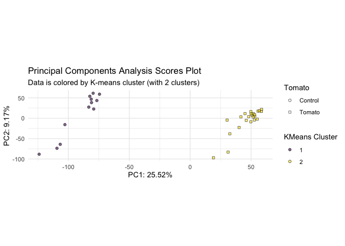<!-- -->

``` r
ggsave(plot = PCA_2_kmeans,
       filename = "figs/PCA_2_kmeans.svg")
```

## Univariate analysis

### ANOVA across diets

``` r
head(Data_filtered_tidy_log2)
```

    ## # A tibble: 6 × 5
    ##   ID        Class   mz_rt         rel_abund rel_abund_log2
    ##   <fct>     <fct>   <chr>             <dbl>          <dbl>
    ## 1 NM_15_120 Control 441.287_4.83          0            0  
    ## 2 NM_15_120 Control 444.9379_1.2      32081           15.0
    ## 3 NM_15_120 Control 297.2663_7.29    113826           16.8
    ## 4 NM_15_120 Control 330.2383_6.45    300218           18.2
    ## 5 NM_15_120 Control 494.185_5.18      15170           13.9
    ## 6 NM_15_120 Control 908.6393_10.8     25427           14.6

``` r
# remove QCs
Data_for_stats <- Data_filtered_tidy_log2 %>%
  filter(Class != "QC")

# check that it worked
unique(Data_for_stats$Class)
```

    ## [1] Control   Red       Tangerine
    ## Levels: Control Red Tangerine QC

``` r
anova_output_df <- Data_for_stats %>%
  select(Class, mz_rt, rel_abund) %>%
  group_by(mz_rt) %>%
  anova_test(rel_abund ~ Class,
             detailed = TRUE) %>%
  adjust_pvalue(method = "fdr") %>%
  as.data.frame()
```

What features are significantly different between at least two groups
across `Class`?

``` r
anova_sig <- anova_output_df %>%
  filter(p.adj <= 0.05)

# how many significant features?
nrow(anova_sig)
```

    ## [1] 144

#### Heatmap of features significant by ANOVA

``` r
ANOVA_heatmap_data_log2 <- Data_filtered_log2 %>%
  filter(Class != "QC") %>%
  select(ID, Class, all_of(anova_sig$mz_rt)) 

ANOVA_heatmap <- 
  pheatmap(ANOVA_heatmap_data_log2[,-c(1:2)],
           scale = "column",
           cluster_rows = TRUE,
           clustering_distance_rows = "euclidean",
           clustering_distance_cols = "euclidean",
           clustering_method = "ward.D2",
           labels_row = ANOVA_heatmap_data_log2$Class,
           fontsize_col = 3,
           color = colorRampPalette(c("#67a9cf", "#f7f7f7", "#ef8a62"))(16))
```

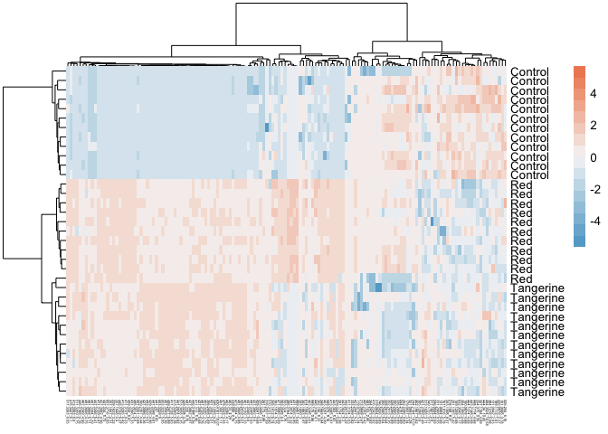<!-- -->

``` r
ggsave(plot = ANOVA_heatmap,
       filename = "figs/ANOVA_sig_heatmap.svg")
```

### Red vs. tangerine

Run all t-tests and use a Benajmini Hochberg false discovery rate
correction

``` r
red_v_tangerine <- Data_for_stats %>%
  filter(Class %in% c("Red", "Tangerine")) %>%
  select(Class, mz_rt, rel_abund) %>%
  group_by(mz_rt) %>%
  t_test(rel_abund ~ Class,
         paired = FALSE,
         p.adjust.method = "BH",
         detailed = TRUE) %>%
  add_significance()
```

What are the significantly different features between red and tangerine
livers?

``` r
red_v_tangerine_sig <- red_v_tangerine %>%
  filter(p <= 0.05)

# how many significant features?
nrow(red_v_tangerine_sig)
```

    ## [1] 284

### Red vs. control

Run all t-tests and use a Benajmini Hochberg false discovery rate
correction

``` r
red_v_control <- Data_for_stats %>%
  filter(Class %in% c("Red", "Control")) %>%
  select(Class, mz_rt, rel_abund) %>%
  group_by(mz_rt) %>%
  t_test(rel_abund ~ Class,
         paired = FALSE,
         p.adjust.method = "BH",
         detailed = TRUE) %>%
  add_significance()
```

What are the significantly different features between red and control
livers?

``` r
red_v_control_sig <- red_v_control %>%
  filter(p <= 0.05)

# how many significant features?
nrow(red_v_control_sig)
```

    ## [1] 306

### Tangerine vs. control

When I run the series of t-tests, I’m getting an error that the data are
consistent. I calculated the SD for each feature by Class for Tangerine
and Control, and found 3 features that have essentially all missing data
across both groups. I am manually removing those 3 features, before
running all t-tests and use a Benajmini Hochberg false discovery rate
correction

``` r
control_v_tangerine_sd <- Data_for_stats %>%
  filter(Class %in% c("Tangerine", "Control")) %>%
  group_by(mz_rt, Class) %>%
  summarize(rel_abund_sd = sd(rel_abund))
```

    ## `summarise()` has grouped output by 'mz_rt'. You can override using the
    ## `.groups` argument.

``` r
# works, and this feature has 0 variance in control
Data_for_stats %>%
  filter(Class %in% c("Tangerine", "Control")) %>%
  filter(mz_rt == "239.1633_3.22")%>%
  group_by(mz_rt) %>%
  t_test(rel_abund ~ Class)
```

    ## # A tibble: 1 × 9
    ##   mz_rt         .y.       group1  group2       n1    n2 statistic    df        p
    ## * <chr>         <chr>     <chr>   <chr>     <int> <int>     <dbl> <dbl>    <dbl>
    ## 1 239.1633_3.22 rel_abund Control Tangerine    12    12     -12.1    11  1.11e-7

``` r
# doesn't work because each group has 0 variance 
Data_for_stats %>%
  filter(Class %in% c("Tangerine", "Control")) %>%
  filter(mz_rt == "431.3026_4.95")%>%
  group_by(mz_rt) %>%
  t_test(rel_abund ~ Class)

# doesn't work because each group has 0 variance 
Data_for_stats %>%
  filter(Class %in% c("Tangerine", "Control")) %>%
  filter(mz_rt == "489.3451_5.62")%>%
  group_by(mz_rt) %>%
  t_test(rel_abund ~ Class)
    
# doesn't work because each group has 0 variance 
Data_for_stats %>%
  filter(Class %in% c("Tangerine", "Control")) %>%
  filter(mz_rt == "501.3074_6.32")%>%
  group_by(mz_rt) %>%
  t_test(rel_abund ~ Class)
```

Remove the 3 features with no variance in both Control and Tangerine.

``` r
tangerine_v_control <- Data_for_stats %>%
  filter(Class %in% c("Tangerine", "Control")) %>%
  filter(!mz_rt %in% c("431.3026_4.95", "489.3451_5.62", "501.3074_6.32")) %>% # not these 3 features
  select(Class, mz_rt, rel_abund) %>%
  group_by(mz_rt) %>%
  t_test(rel_abund ~ Class,
         paired = FALSE,
         p.adjust.method = "BH",
         detailed = TRUE) %>%
  add_significance() %>%
  as_tibble()
```

What are the significantly different features between tangerine and
control livers?

``` r
tangerine_v_control_sig <- tangerine_v_control %>%
  filter(p <= 0.05)

# how many significant features?
nrow(tangerine_v_control_sig)
```

    ## [1] 271

### Control vs. tomato

Run all t-tests and use a Benajmini Hochberg false discovery rate
correction

``` r
control_v_tomato <- Data_for_stats %>%
  mutate(Tomato = if_else(Class == "Control", "Control", "Tomato")) %>%
  select(Tomato, mz_rt, rel_abund) %>%
  group_by(mz_rt) %>%
  t_test(rel_abund ~ Tomato,
         paired = FALSE,
         p.adjust.method = "BH",
         detailed = TRUE) %>%
  add_significance() %>%
  as_tibble()
```

What are the significantly different features between control and tomato
livers?

``` r
control_v_tomato_sig <- control_v_tomato %>%
  filter(p <= 0.05)

# how many significant features?
nrow(control_v_tomato_sig)
```

    ## [1] 279

Write out these features for Supplementary Table 15.

``` r
write_csv(control_v_tomato_sig,
          file = "TomatoVsControl_SigDiff_TTestFDR.csv")
```

#### Volcano plot

Wrangle

``` r
# calculate mean rel abund by sample, and avg FC diff by feature
control_v_tomato_volcano_data <- Data_for_stats %>%
  mutate(Tomato = if_else(Class == "Control", "Control", "Tomato")) %>%
  group_by(Tomato, mz_rt) %>%
  summarize(mean_rel_abund = mean(rel_abund)) %>%
  pivot_wider(names_from = Tomato, values_from = mean_rel_abund) %>%
  mutate(FC_tomato_div_control = Tomato/Control) 

# bind back pval
control_v_tomato_tobind <- control_v_tomato %>%
  select(p)

# calculate log2FC, and neglog10p
control_v_tomato_volcano_data <- 
  bind_cols(control_v_tomato_volcano_data, control_v_tomato_tobind) %>%
  mutate(log2_FC_tomato_div_control = if_else(FC_tomato_div_control > 0, 
                                              log2(FC_tomato_div_control),
                                              -(log2(abs(FC_tomato_div_control)))), 
         neglog10p = -log10(p))

# set FC for features present in tomato and absent in control to 13
control_v_tomato_volcano_data <- control_v_tomato_volcano_data %>%
  mutate(log2_FC_tomato_div_control = if_else(is.infinite(log2_FC_tomato_div_control), 
                                              13, log2_FC_tomato_div_control))

# create a df of features passing FC and pval cutoffs higher in tomato
higher_in_tomato <- control_v_tomato_volcano_data %>%
  filter(p <= 0.05 & log2_FC_tomato_div_control >= 1)

# create a df of features passing FC and pval cutoffs higher in control
higher_in_control <- control_v_tomato_volcano_data %>%
  filter(p <= 0.05 & log2_FC_tomato_div_control <= -1)  
```

Plot

``` r
(control_v_tomato_volcano <- control_v_tomato_volcano_data %>%
  ggplot(aes(x = log2_FC_tomato_div_control, y = neglog10p, 
             text = glue("Mass_retention time: {mz_rt}
                         P-value: {p}
                         Fold change tomato/control: {round(FC_tomato_div_control, 2)}"))) +
  geom_point(color = "grey") +
  geom_point(data = higher_in_tomato, 
             aes(x = log2_FC_tomato_div_control, y = neglog10p),
             color = "tomato") +
  geom_point(data = higher_in_control, 
             aes(x = log2_FC_tomato_div_control, y = neglog10p),
             color = "black") +
  geom_vline(xintercept = 1, linetype = "dashed", color = "grey") +
  geom_vline(xintercept = -1, linetype = "dashed", color = "grey") +
  geom_hline(yintercept = 1.3, linetype = "dashed", color = "grey") +
  coord_cartesian(xlim = c(-2.2, 14)) +
  labs(title = "Volcano Plot of Features Different in Mice Fed Tomato and Control Diets",
       subtitle = "Red points are higher in tomato fed aninmals, while black points are higher when on control diets",
       # caption = "Vertical dashed lines represent a fold change >2 or <-2, and horizontal dashed line represents an FDR corrected p-value of 0.05.\nFeatures absent in control and present in tomato assigned a log2 fold change of 13",
       x = "Log2 Fold Change (Tomato/Control)",
       y = "-Log10 P-value"))
```

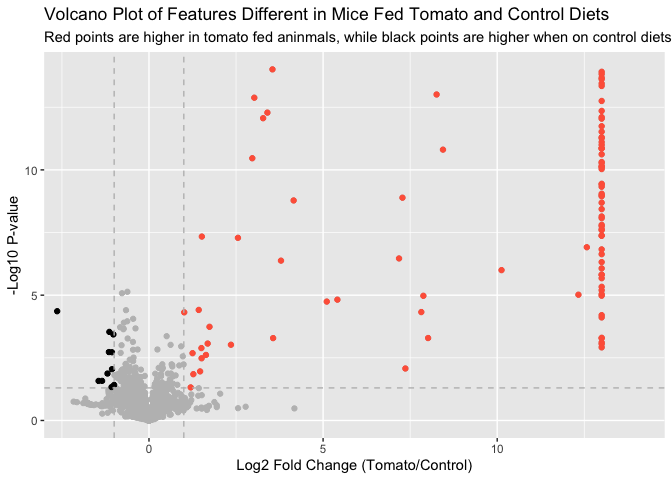<!-- -->

Save

``` r
ggsave(plot = control_v_tomato_volcano,
       filename = "figs/volcano_plot_tomato_v_control.svg")
```

##### Interactve volcano plot

Create an interactive plot, where the hover text includes the
monoisotopic mass, the fold change between tomato/control, and the
p-value.

These interactive plots won’t knit into a github_document, but you can
find the interactive plot as interactive_volcano_plot.html in this repo.

``` r
volcano_plot <- ggplotly(control_v_tomato_volcano, tooltip = "text")
```

Save

``` r
saveWidget(widget = volcano_plot,
           file = "interactive_volcano_plot.html")
```
